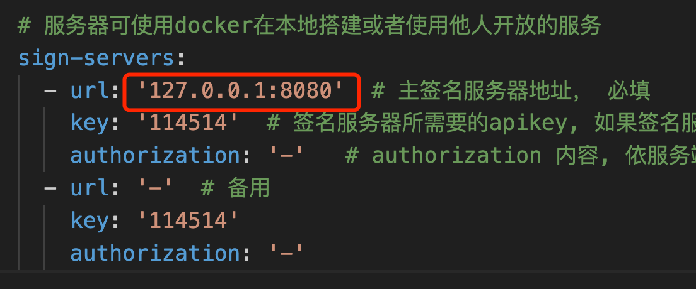
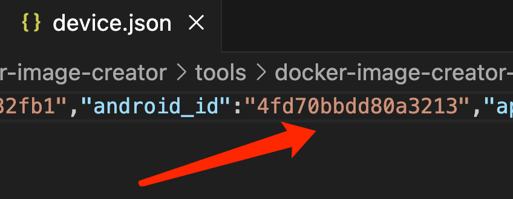
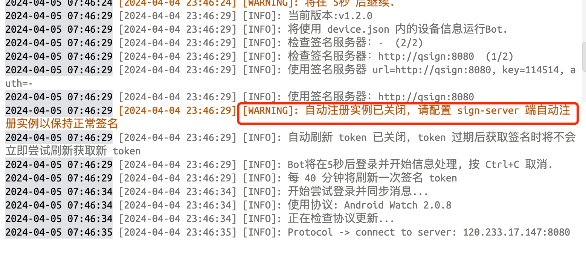
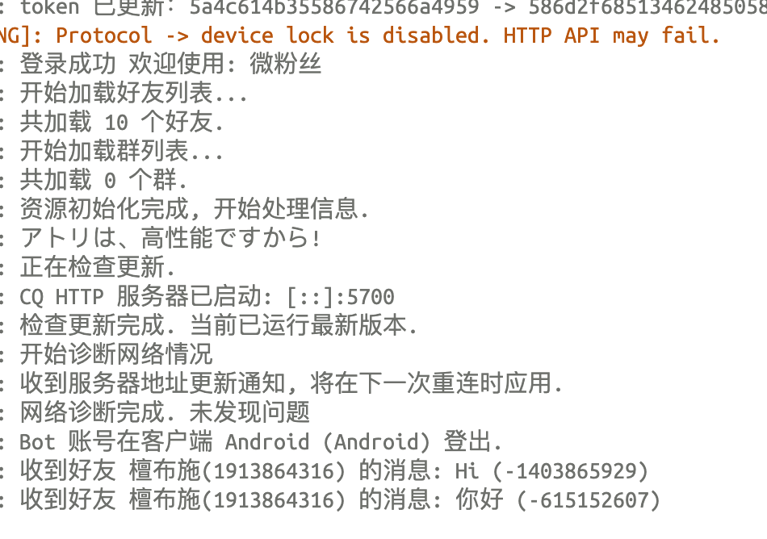

# Docker环境下部署qsign签名服务器
>早前已经将 go-cqhttp 成功部署到 Docker 环境中，但鉴于qsign签名服务器尚未构建，所以一直没有将 go-cqhttp 上线测试。目前已顺利完成 Docker 内 qsign 服务器的安装工作，暂时采用 Docker 市场提供的第三方镜像作为解决方案。未来计划抽空自制 qsign 镜像，以实现更精细的定制化控制。
## 1 拉取和运行镜像：xzhouqd/qsign:8.9.63
```bash
docker run -d --restart=always --name qsign -p 8080:8080 -e ANDROID_ID=xxxxxxx xzhouqd/qsign:8.9.63
```
只需要这一条命令，整个 qsign 服务器就运行起来了。参数说明：

- -d 后台运行
- --restart=always 服务自动重启
- --name asign 给容器取的名字叫做：qsign
- -p 8080:8080 端口映射，可以通过宿主机的 8080 端口访问容器内部的 8080 端口
- e ANDROID_ID=xxxxxxxx  环境变量，将ANDROID_ID 参数传递给容器
- xzhouqd/qsign:8.9.63 安装用到的镜像，自动从dockerhub里拉取

## 2 在宿主机或局域网内连接 qsign 服务器
如果你的宿主机上（不是在 docker 里）正好运行了一个 go-cqhttp 服务，将该服务的配置文件修改后，即可连接并使用该签名服务器。修改如下：

- config.yml

将 sign-servers 里主签名服务器地址填为：宿主机IP地址，端口号为 8080，即形式为：xxx.xxx.xxx.xxx:8080，本机可直接使用 127.0.0.1:8080 即可。

<center>图1  修改 config.yml 文件</center>

- device.json

请将 android_id 填入你的 ANDROID_ID， 可以根据自己的喜好填写即可。

<center>图2  修改 device.json 文件</center>

## 3 在宿主机里其他容器上连接 qsign 服务器
容器之间相互调用，就可以用 docker-compose 脚本来实现，将两个容器编排在一个文件里，以虚拟网络link的方式即可实现容器之间进行网络互访。
编辑 docker-compos.yml 文件，内容如下：
```yml
version: "3.5" # 使用版本 3.5

services: # 服务列表
  cqhttp: # go-cqhttp 服务
    container_name: cqhttp # 指定容器名称
    image: go-cqhttp-alpine:0.0.1 # 使用的镜像名称
    networks: # 本容器加入的网络，可以是多个
      - my_network
    links: # 连接到其他的容器的列表，此处表示 cqhttp 容器会放翁 qsign 容器
      - qsign

  qsign: # qsign 服务
    container_name: qsign # 指定容器名称
    image: xzhouqd/qsign:8.9.63 # 使用的镜像名称
    ports: # 镜像端口列表
      - 8080:8080
    environment: # 环境变量，会传递到容器里
      ANDROID_ID: xxxxxx # 填入你想使用的ID，可以是昵称、手机号啥的，都可以
    networks: # 本容器加入的网络，可以是多个
      - my_network
networks:
  my_network:
    name: my_network
 ```
 在 docker-compos.yml 文件所在目录下，使用终端输入命令：
 ```bash
 docker-compose up -d
 ```
## 4 应用效果

<center>图3  应用效果-1</center>

上图中，红框内的内容没明白是什么意思，不知道是不是 go-cqhttp 的 bug，但似乎不影响使用。


<center>图4  应用效果-2</center>

从上图可以看到，收到了群里发来的消息，但目前只能“听”，不能“说”。


## 5 扩展
### 5.1 go-cqhttp 和 qsign 是分开还是合在一个docker里
一般建议将go-cqhttp和qsign分开部署在不同的Docker容器中，以保持系统的模块化、易维护性、资源隔离和故障隔离优势，更关键还有就是容易扩充和分布式部署，满足负载均衡的需要。
只有当两个服务间存在极为紧密的关联，资源需求高度一致，且通信效率要求极高时，才考虑将其合并部署在同一容器内。实际决策应依据具体项目需求、资源状况和运维策略来确定。
此处我们决定采用分离的方式。
### 5.2 将dockerhub里的镜像存储到本地
对于比较难找的镜像，为了便于以后加载使用，避免出现上传用户删除镜像导致以后找不到该镜像的情况，所以需要将镜像保存到本地。
- 保存镜像
使用 docker save 命令：
```bash
docker save -o xzhouqd_qsign_8.9.63.tar xzhouqd/qsign:8.9.63
```
保存的文件名为：xzhouqd_qsign_8.9.63.tar，文件还是不小的，达到500多兆。
- 加载镜像
使用 docker load 命令：
```bash
docker load -i xzhouqd_qsign_8.9.63.tar
```
使用 load 加载后，镜像就会出现在docker 镜像列表里了。

# 参考文章
[Linux服务器下 签名服务器+Mirai部署 详细教程](https://zhuanlan.zhihu.com/p/652785933)

[使用qsign解决gocq启动code45报错 - 知乎](https://zhuanlan.zhihu.com/p/648839865?utm_id=0)


