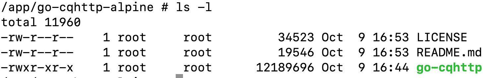

# 制作一个搭建go-cqhttp应用的docker镜像
>一直有个想自己部署一个QQ机器人，并成功完成在Windows环境下基于go-cqhttp的搭建工作。考虑到我有一台常年在线的群晖 NAS，并且已经配置并启用了Docker服务，可否将go-cqhttp迁移至NAS上的Docker容器中运行吗呢？同时，为进一步提升便捷性，计划将go-cqhttp的配置文件整合入容器内，以便一键部署，避免繁琐的配置步骤。在此过程中，秉持精简原则，在确保功能完备的同时，力求最大限度地压缩镜像体积，实现轻量化部署。

`重要提示：使用 go-cqhttp 或 其他工具，都有可能造成 QQ 账号被风控， 请谨慎使用。建议用小号，不要因 QQ 号被风控造成损失！！！`

此次目标分两步，第一步实现在 alpine 镜像上安装 go-cqhttp，并启动、配置好 go-cqhttp，确保跟随容器启动、停止。
## 1 在alpine镜像上安装 go-cqhttp
### 1.1 拉取 alpine 镜像
习惯指定版本号，避免版本更新导致镜像失效，此次选用 alpine:3.10。
```bash
docker pull alpine:3.10
```
# 1.2 使用基础镜像创建容器
下面代码的功能是：
- 使用 alpine 镜像创建容器
- 指定容器名称为 go-cqhttp-alpine
- 将用户的 home 目录下的 docker-volumes/go-cqhttp-alpine 目录挂载到容器的 /app/go-cqhttp-alpine 目录
```bash
docker run -itd -v ~/docker-volumes/go-cqhttp-alpine:/app/go-cqhttp-alpine --name go-cqhttp-alpine alpine:3.10
```
### 1.3 下载 go-cqhttp
在 github 上的下载页地址为：https://github.com/Mrs4s/go-cqhttp/releases/，需要根据需求选择对应的版本号。我的 mac 电脑和 NAS 都可以使用 amd64 的版本。下载地址为：https://github.com/Mrs4s/go-cqhttp/releases/download/v1.0.0-rc3/go-cqhttp_linux_amd64.tar.gz
### 1.4 解压 go-cqhttp
解压到当前电脑系统的 ~/docker-volumes/go-cqhttp-alpine 目录下，由于此目录为 docker 挂载的目录，所以文件在docker内部也能看到，并可直接进行操作。
### 1.5 使用 docker exec 命令进入容器内部
```bash
docker exec -it go-cqhttp-alpine /bin/sh
```
打开的终端如下图所示：

<center>图1  docker exec 进入容器内部</center>

进入容器内部目录：/app/go-cqhttp-alpine，看到文件列表如下：（这些文件是刚才通过挂载目录拷入的）

<center>图2  压缩包解压后的文件列表</center>

### 1.6 在容器内部启动 go-cqhttp
```bash
cd /app/go-cqhttp-alpine
./go-cqhttp
```

<center>图3  选择通信方式</center>

选：0，回车

<center>图4  选择后执行自动生成 config.yml</center>

ctrl + c，退出，重新执行：./go-cqhttp
```bash
./go-cqhttp
```

<center>图5  协议选择不匹配，需要修改设备配置文件 device.json</center>

- 账号密码未配置, 将使用二维码登录
为了简化配置，也为了方便分享，就不配置 config.yml 了，直接使用默认配置，将启用二维码登录
- 虚拟设备信息不存在, 将自动生成随机设备
由于默认没有配置虚拟设备，所以会出现此提示，同时在当前目录下会生成 device.json 的文件
- no usable sign server
未配置签名服务器或签名服务器不可用, 这可能会导致登录 45 错误码或发送消息被风控，目前只是简单的提示，不会影响使用。但后期还是要考虑解决前面服务器的问题
- 当前协议不支持二维码登录, 请配置账号密码登录
这个可以通过后面配置 device.json 来解决。如果需要配置用户名密码的话，请自行修改 config.yml 和 device.json 文件。

### 1.7 配置 device.json

<center>图6  修改 device.json 文件</center>

编辑 device.json 文件

<center>图7  更改协议编号</center>

将 protocol 改为 2

### 1.8 再次启动 go-cqhttp
```bash
./go-cqhttp
```
出现扫码二维码提示，用手机 QQ 扫码登录。提示在手表上登录，因为选择的协议 2 就是智能手表登录协议。

<center>图8  扫码后成功登录 QQ</center>

至此，完成第一步目标：在docker里安装go-cqhttp，并成功登录。实现了监控 QQ 群消息和私聊消息的功能。所有配置文件，仅仅改动了一个字符，所以很容易实现配置文件的一键 docker 镜像部署。

下面开始第二个目标。

## 2 创建镜像
实现机理，制作一个 Dockerfile 文件，引用：alpine:3.10 作为初始镜像，将下面的文件通过 COPY 写入 Dockerfile 文件，并保存。再用 docker build 命令构建镜像即可。

<center>图9  正常运行时的文件结构</center>

上图中，有些是运行后产生的数据文件，初始镜像中并不需要这些文件，所以可以删除。包括：data 目录、logs 目录、session.token 文件。

### 2.1 文件准备
- 在任意位置创建一个文件夹，名称可随便定，此处命名为 build-files，把 签名的挂载目录 go-cqhttp-alpine 文件夹拷贝进去
- 在文件夹 build-files 中创建一个 Dockerfile 文件，并写入如下内容：
```bash
FROM alpine:3.10

WORKDIR /app/go-cqhttp-alpine

COPY go-cqhttp-alpine /app/go-cqhttp-alpine/
```
最后形成如下目录结构：

<center>图10  为编译镜像准备的文件结构</center>

### 2.2 构建镜像
在终端窗口中 cd 到 build-files 文件夹，执行：
```bash
docker build -t go-cqhttp-alpine:1.0.0 .
```
镜像构建成功！生成的镜像为 go-cqhttp-alpine:1.0.0。
### 2.3 运行容器
```bash
docker run -itd --name go-cqhttp-alpine go-cqhttp-alpine:1.0.0
```
容器成功运行！
### 2.4 进入容器运行 go-cqhttp
```bash
docker exec -it go-cqhttp-alpine /bin/sh
```
进入容器内部，执行：
```bash
cd /app/go-cqhttp-alpine
./go-cqhttp
```
出现下面的扫码登录提示：

<center>图11  扫码登录</center>

扫码登录即可。如果要退出，请输入 ctrl + c。

## 3 总结
目前仅仅是安装成功，并实现了：
- 登录功能
下一步可以配置 config.yml 文件，实现用户名密码自动登录，就无需每次扫码登录了。此部分可以自行尝试。
- 消息接收
实现了 QQ 群消息和私聊消息的接收。下一步可以实现消息的转发，实现群聊和私聊的转发。
