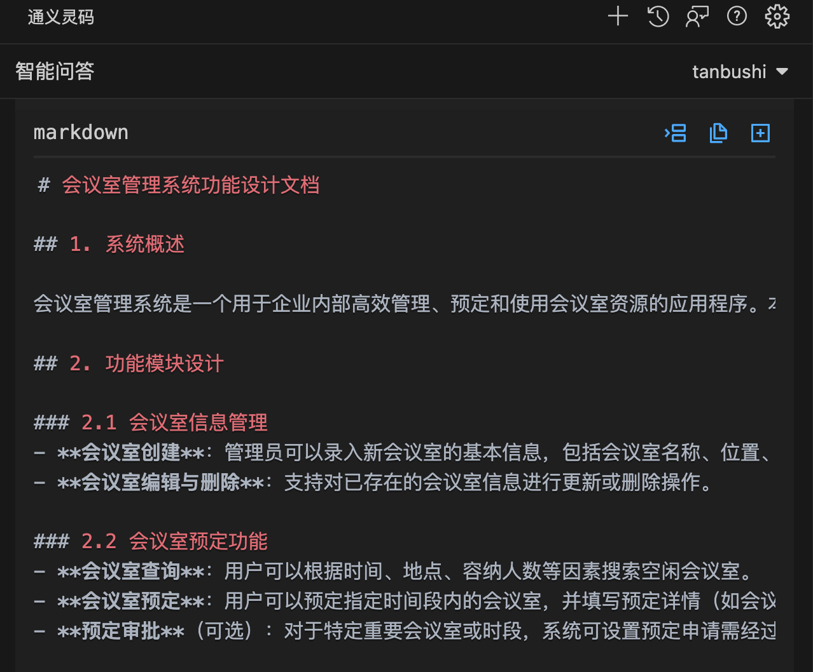
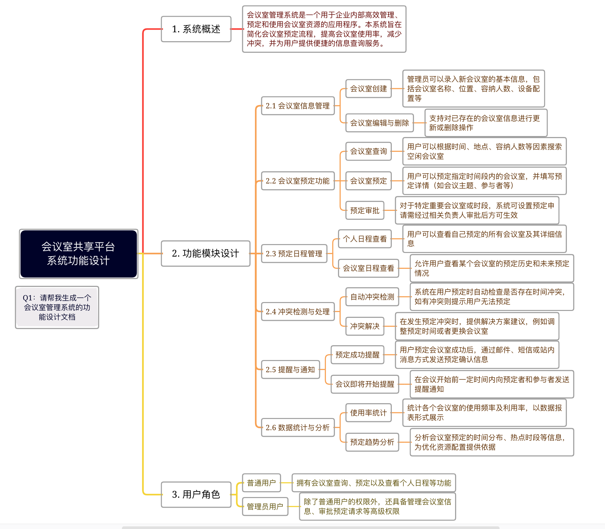
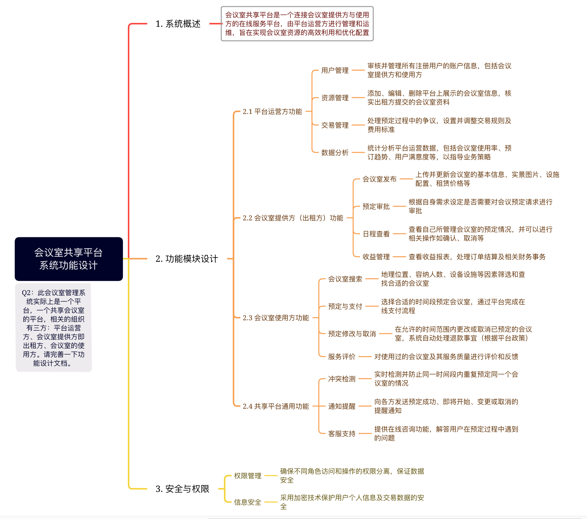
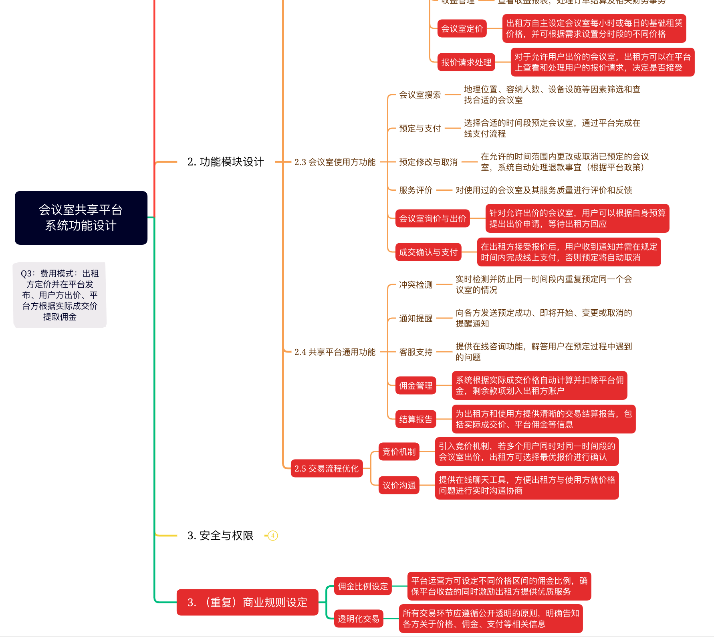
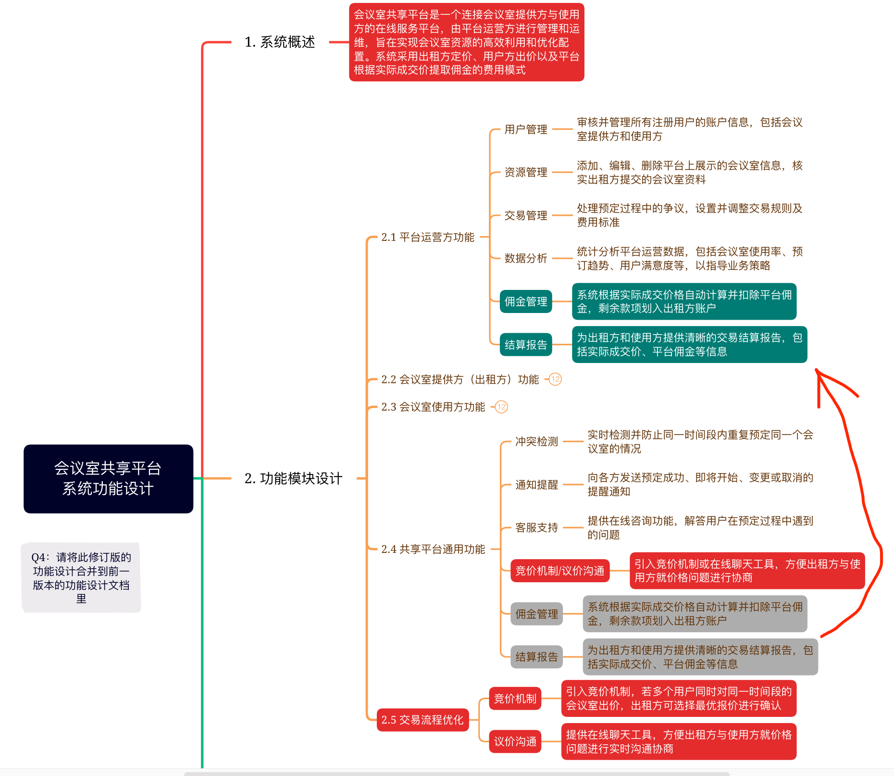
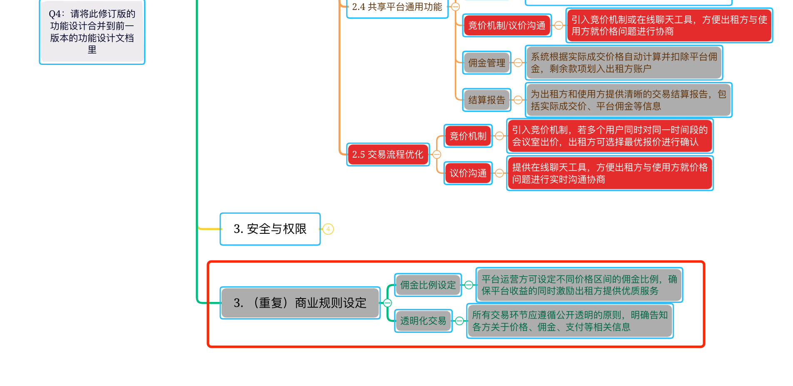
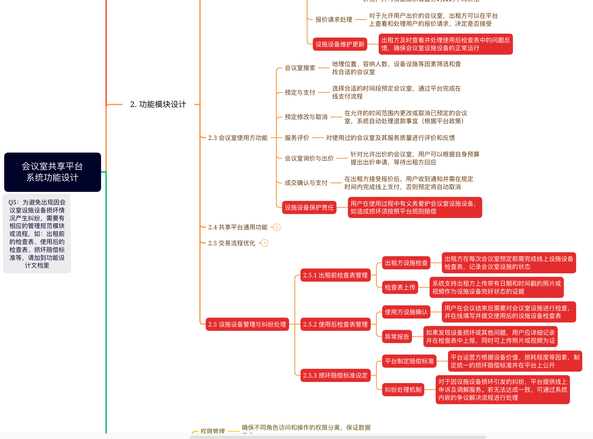

# 试用AI做方案设计，通义灵码——一个博学但“健忘”的智能编码辅助工具
>最近，人工智能编程领域的创新成果层出不穷，让我这个程序员跃跃欲试。今天，我终于决定亲自体验一下阿里云研发的智能编码助手——通义灵码，在我的Visual Studio Code编辑器中成功安装了这款插件，并顺利开启了它的功能。当我打开插件对话框并输入相关的设计需求或代码问题时，只需一键发送给通义灵码，就能迅速得到它基于深度学习和自然语言处理技术生成的结果。

>在安装通义灵码插件的过程中，我发现其设计简洁易用，几分钟内便能完成配置，对于有疑问的开发者，我也非常乐意在评论区提供帮助。我制定了一个详细的计划，打算按照完整的软件开发流程逐步引导通义灵码，期望能够通过磨合达到一定的默契程度，共同完成从项目初期的功能需求分析、撰写详细的功能设计文档，再到后续的系统架构设计、数据库表结构设计等重要环节，最终过渡到实际的前后端架构选择与具体代码编写工作。尽管通义灵码可能不直接支持绘制架构图、流程图以及实体关系图（E-R图）这类可视化设计，但在程序开发过程中，特别是在解决局部逻辑难题、生成高质量代码片段及编写单元测试等方面，通义灵码的辅助作用显得尤为突出。

本次实战测试的核心目标是全面评估通义灵码的各项“能力”，了解其在实际编程过程中的表现是否符合预期，能否有效解决开发者面临的问题，然后根据其特点进行灵活应用，真正做到“因材致用”。现在，就让我们一起踏上这段探索之旅吧！

首先，我先来试试通义灵码的文档编写能力，主要学习如何用她来编写文档，以及后续学习用她来编写代码。
## 1 测试标的和方法
次测试的假想项目是：我要开发一个“会议室共享平台”，通过和通义灵码一问一答的方式，让她编写项目功能设计文档。按照由粗向细的方式，依次提出以下问题（实测是即兴问的），只是为了让读者有个预先的了解和“心理准备”，就先整理出来了：
- Q1：请帮我生成一个会议室管理系统的功能设计文档。
推荐问法：请帮我生成一个会议室管理系统的功能设计文档，要求如下：巴拉巴拉...
- Q2：此会议室管理系统实际上是一个平台，一个共享会议室的平台，相关的组织有三方：平台运营方、会议室提供方即出租方、会议室的使用方。请完善一下功能设计文档。
- Q3：费用模式：出租方定价并在平台发布、用户方出价、平台方根据实际成交价提取佣金
- Q4：请将此修订版的功能设计合并到前一版本的功能设计文档里
- Q5：为避免出现因会议室设施设备损坏情况产生纠纷，需要有相应的管理规范模块或流程，如：出租前的检查表、使用后的检查表、损坏赔偿标准等，请加到功能设计文档里
- Q6：将 2.5 的内容合并到前面的功能设计文档里
- Q7：为了方便文档的版本管理，请给每次生成的文档加一个简单好记的版本号
- Q8：请将 会议室共享平台功能设计文档 V1.1 完整显示一遍
- Q9：我一会要外出，需要关机，请问回来后，你还记得我们的 v1.1 版本吗？还可以继续往下进行吗？
## 2 开始灵魂拷问，看看AI怎么答，哈哈
>备注1：Q 表示是我问的，A 表示是 AI 答的，编号 1～9 是问答的轮次，按时序编号
>备注2：示例项目非真实开发，所以不要过于较真哈
### 2.1 Q1：请帮我生成一个会议室管理系统的功能设计文档。
A1：当然可以，以下是基于一个基础的会议室管理系统初步的功能设计文档：

图1  通义灵码生成的文档格式为 markdown

上面仅仅是展示一下通义灵码生成的文档样式，我用思维导图归纳了她的输出如下图：

图2  根据 AI 生成的文档形成的脑图——首次回答

为体会一步步“无脑”和 AI 一起写文档时相互启发的感觉，我故意给的提问很粗糙、不具体，所以生成的内容应该和网上搜索的结果也差不太多吧。
继续往下走，下面的提问我又具体了一点，告诉她系统是一个共享会议室的平台
### 2.2 Q2：此会议室管理系统实际上是一个平台，一个共享会议室的平台，相关的组织有三方：平台运营方、会议室提供方即出租方、会议室的使用方。请完善一下功能设计文档。
A2：当然，基于您提供的信息，会议室管理系统是作为一个共享平台运作的，涉及三方角色：平台运营方、会议室提供方（出租方）、会议室使用方。以下是针对这三方细化后的功能设计文档：

图3  按照搭建平台的需求生成的功能设计文档

比较第二次（A2表示，下同）的回答 和 A1的回答，系统概述部分将会议室管理系统换成了在线平台，功能模块部分也改成了三方组织的功能以及平台通用功能，将A1中的几个功能都拆开放到A2的四个功能模块里了，还是蛮智能的，小小可以。
下面我又加了一个点，提出了平台费用方面的需求。
### 2.3 Q3：费用模式：出租方定价并在平台发布、用户方出价、平台方根据实际成交价提取佣金。
A3：在考虑出租方定价、用户方出价以及平台方提取佣金的费用模式下，我们对会议室共享平台的功能设计文档做如下补充：

图4  加入费用需求后的方案

从上图可以看出，这次 AI 增加了比较多关于费用、定价等方面的内容，其中甚至主动加上了“竞价机制”、“议价沟通”这两个比较容易忽视的功能，有点意思。但也发现了小问题，上一次就存在节点“3.安全与权限”，这一次又加了个节点3，却并没有说明是否替换前一次的节点3。
此次输出因为是修改部分内容，所以 AI 输出的只是部分变动的内容，并没有上图那么多信息，我怕前面的内容会丢失，所以下一步就是测试 AI 对多次输出的文档内容进行合并的功能。
### 2.4 Q4：请将此修订版的功能设计合并到前一版本的功能设计文档里。
A4：当然，以下是合并了修订版费用模式功能设计后的完整会议室共享平台功能设计文档：

图5-1  第一次版本合并的示意图上半部分

图5-2  第一次版本合并的示意图下半部分

合并成功后，发现图x-1 中灰色的部分调整了位置，图x-2 中灰色的部分没有生成，具体是对功能的主动调整还是她忘了，就不得而知了，至少说明她在合并文档的时候，会有内容调整。

其实关于修改功能的测试已经差不多了，但还是想试试再加功能，呜呜！
### 2.5 Q5：为避免出现因会议室设施设备损坏情况产生纠纷，需要有相应的管理规范模块或流程，如：出租前的检查表、使用后的检查表、损坏赔偿标准等，请加到功能设计文档里。
A5：当然，针对会议室设施设备的管理规范，我们可以在功能设计文档中增加以下模块：

图6  增加设施检查及验收规范

红色部分为新增加的功能，由于 AI 按行输出，速度不是很快，所以她为了减少输出，一般只输出变动的内容。所以下一步我提示 AI 把此步骤产生的内容合并起来，避免缺失。
### 2.6 Q6：将 2.5 的内容合并到前面的功能设计文档。
A6：当然，以下是合并了设施设备管理与纠纷处理模块的完整会议室共享平台功能设计文档：
合并后输出的文档，达到合并的要求，没有丢失关键信息，没必要再上图了。本来考虑让 AI 最终生成合好的文档，这样就不用每一次交流后都要做记录，突然想到能不能和 git 类似，可以做“版本合并”？所以下面测试一下。
### 2.7 Q7：为了方便文档的版本管理，请给每次生成的文档加一个简单好记的版本号。
A7：当然，为了方便文档的版本管理，我会在每次生成或修订后的文档上添加一个版本号。以下是整合了设施设备管理与纠纷处理模块后会议室共享平台功能设计文档的V1.1版：
此操作在内容方面 AI 提示：[...（正文内容不变）...]。
下面让 AI 将 v1.1 版完整显示并检查。
### 2.8 Q8：请将 会议室共享平台功能设计文档 V1.1 完整显示一遍。
A8：当然，为了方便文档的版本管理，我会在每次生成或修订后的文档上添加一个版本号。以下是整合了设施设备管理与纠纷处理模块后会议室共享平台功能设计文档的V1.1版：
很好！v1.1 版显示和设置版本前的内容一致。虽然感觉有版本的概念，但其实没有什么用，因为 AI 没次都提示内容是根据上下文重新生成的。
### 2.9 Q9：我一会要外出，需要关机，请问回来后，你还记得我们的 v1.1 版本吗？还可以继续往下进行吗？
A9：虽然我这个AI模型在一次对话中可以模拟连续的记忆和上下文理解，但在我被关闭或重启后，不会保留具体的会话历史。因此，如果您离开后再次返回并启动对话，我将无法直接回忆起先前讨论的确切内容，除非您在下次对话时提供相关信息以唤起之前的上下文。
不过，您可以把 V1.1 版本的会议室共享平台功能设计文档的关键点记录下来，或是在对话结束后立即手动保存相关内容，这样当您回来时就可以基于这些记录继续讨论或推进工作了。另外，如果您在将来与我交谈时提及 V1.1 版本，只要提供足够的线索，我仍然可以帮助您回顾和延续有关该版本的讨论。
## 3 总结
根据此次测试，得到几个知识点：

- AI 知识确实渊博，但还是需要人会问，得到答案后还要会总结
- AI “健忘”，目前的 AI 还只是在吸引眼球的阶段，目前还处在阳光普照阶段，离好用还有一段距离，可以展望在不久的将来，大模型服务商讲用户的问题和得到的成果（即上下文）保存到服务器上，进入个性化定制服务阶段
- AI 提供的成果，需要做好记录和备份，好在很多 AI 目前免费，而且“脾气好”，反正有问题就问呗，人家又不睡觉。哈哈
- 下一步测试一下 AI 在软件架构方面的能力，看看是不是比写方案强

此次测试还是小有收获，后面还会保持各种尝试。虽然短期内 AI 代替程序员还不现实，但目前如果一个程序员不使用 AI，就一定会被每天带着多个 AI “程序员”一起工作的程序员所替代。

>我们能否和 AI 一起飞起来，我不知道，但我知道，我们只要一起努力学习、拥抱改变，就一定会飞得更高！加油！！