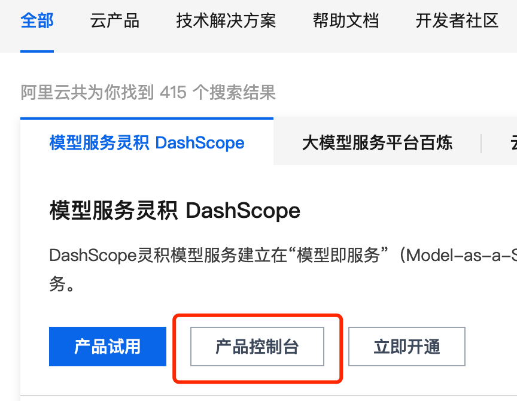
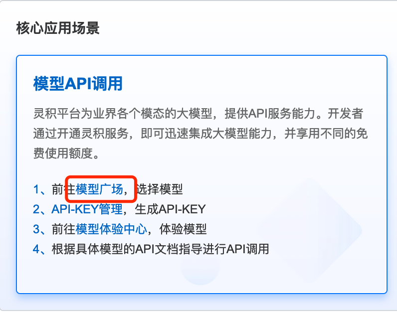
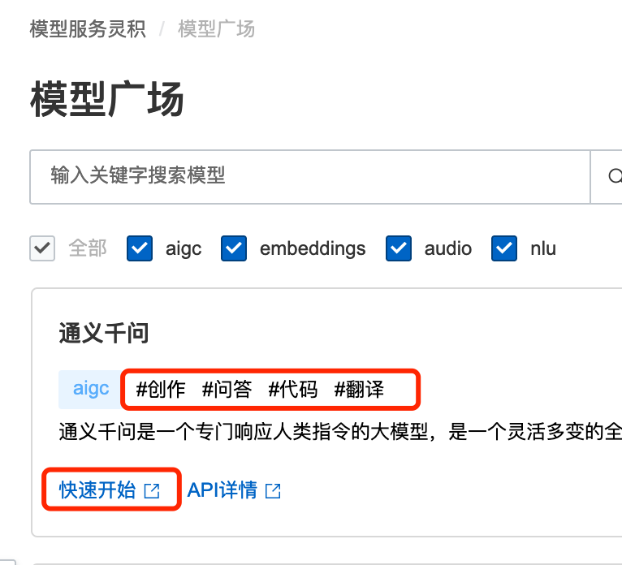
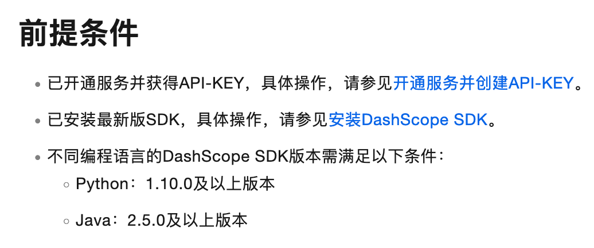
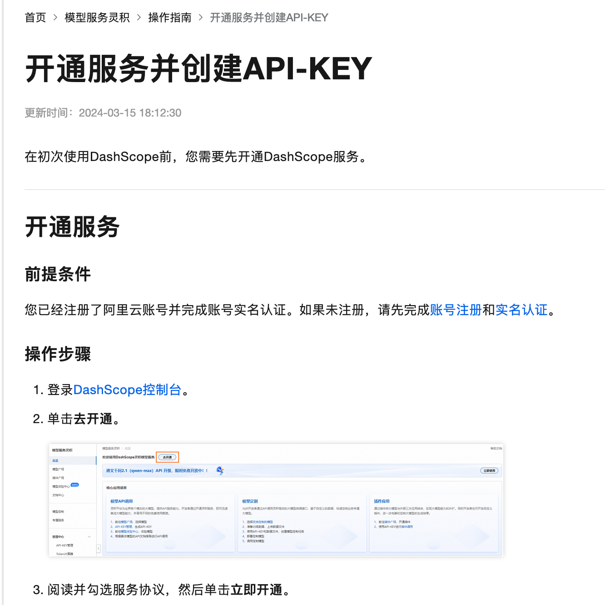
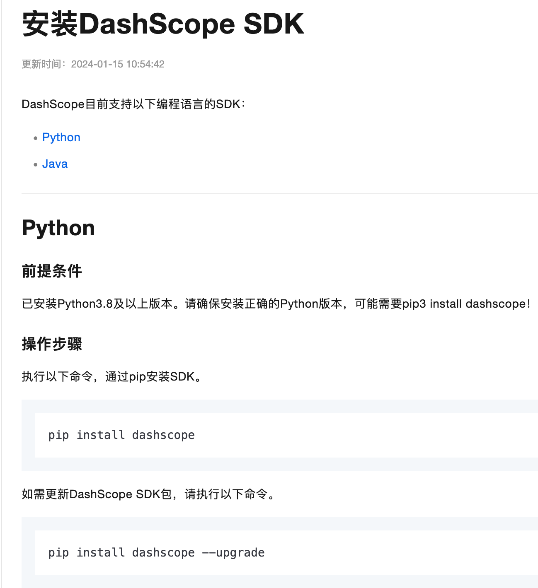
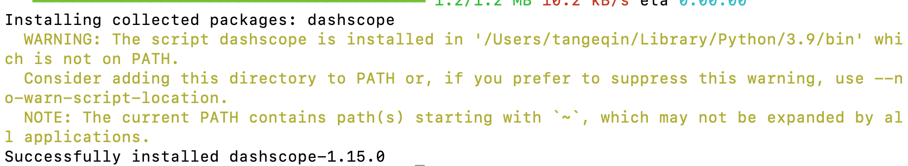
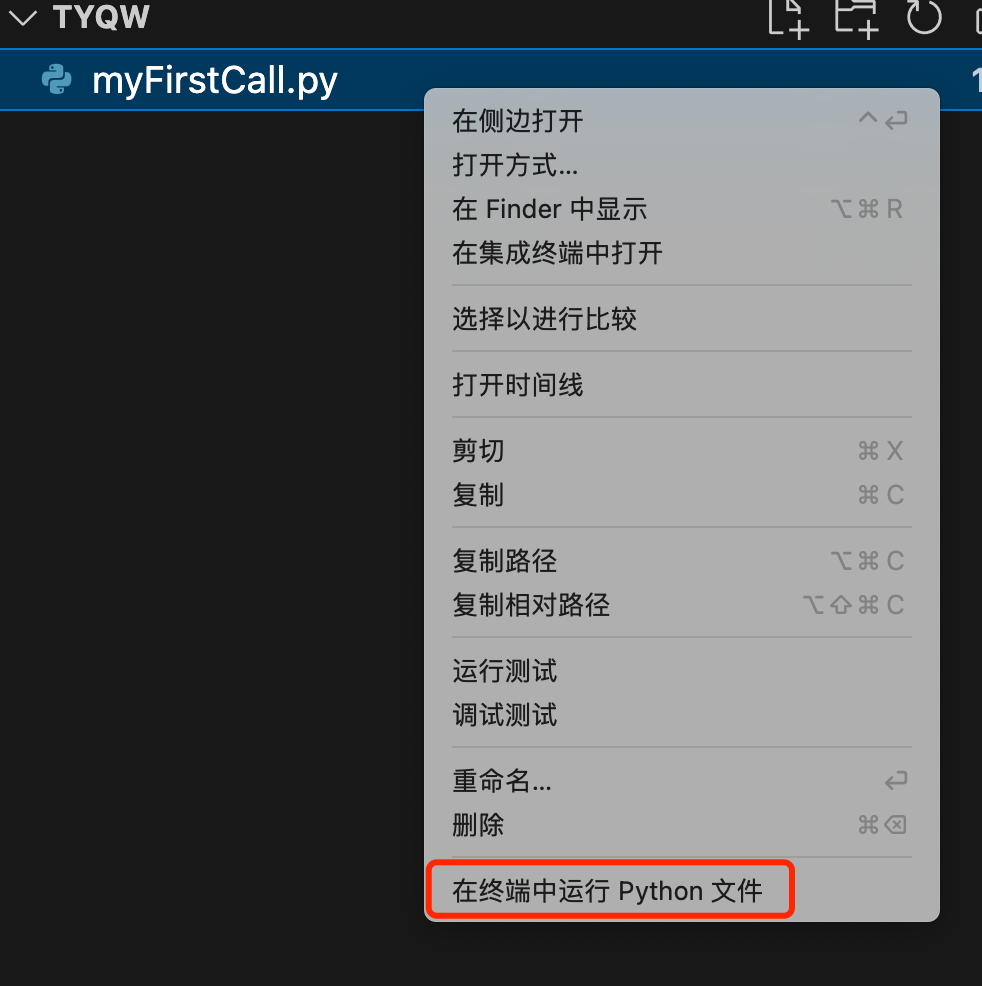
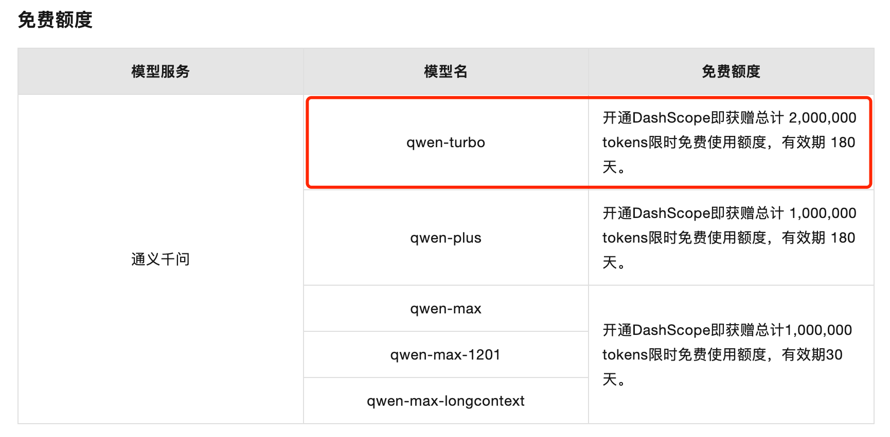
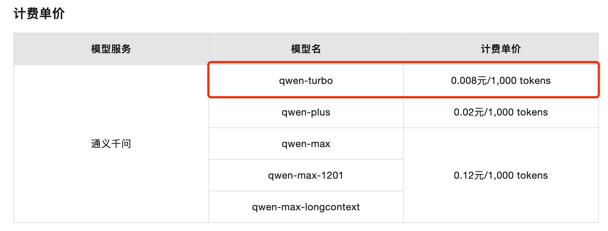

# 零基础尝试调用通义千问API的过程记录

>使用了通义灵码插件后，感觉非常不错，因此想尝试调用通义灵码的API。但在寻找了一段时间后，并未找到相关API。于是，我转向尝试使用通义千问，经过搜索，在阿里云的DashScope灵积模型服务中找到了通义千问提供的API。

## 1 关于通义千问
通义千问是阿里云开发的大语言模型(Large language Model )LLM,旨在提供广泛的知识和普适性，可以理解和回答各领域中的问题。
- 网页使用版本地址：https://tongyi.aliyun.com/qianwen/
- 官网文档地址：https://help.aliyun.com/zh/dashscope/developer-reference/

## 2 找到通义千问
可以从阿里云官网 [https://www.aliyun.com](https://www.aliyun.com) 首页通过搜索“灵积模型服务”找到这个产品。
<center>图1  从阿里云官网找到模型服务灵积</center>
点击“产品控制台”，选择“模型 API 调用”这个应用场景：
<center>图2  模型 API 调用</center>
从“模型 API 调用”这个场景里点击进入“模型广场”，可以看到通义千问的介绍卡片。
<center>图3  通义千问模型</center>

## 3 开通服务并安装 SDK
因为我想使用通义千问来测试代码功能，所以上图的“通义千问”模型，可以实现：创作、问答、代码、翻译，既然我是零基础，那就从“快速开始”开始吧！
<center>图4  使用通义千问 API 的前提条件</center>

### 3.1 开通服务并创建API-KEY
点击“开通服务并创建API-KEY” 的链接
<center>图5  开通服务并创建 API-Key</center>

### 3.2 安装 DashScope SDK
我选择使用 Python，那就安装 Python 的 SDK 吧
<center>图6 安装 DashScope SDK</center>
要是 pip install dashscopt 安装失败，就使用 pip3 install dashscope
<center>图7 安装成功</center>
提示安装成功
## 4 测试开发
继续回到快速入门，继续下一步：API-KEY 设置
### 4.1 设置 API-KEY
在终端窗口输入
```bash
export DASHSCOPE_API_KEY="YOUR_DASHSCOPE_API_KEY"
```
将上面的“YOUR_DASHSCOPE_API_KEY”换成你申请到的真实 APIKEY 即可

### 4.2 编写Python代码
在 vscode 里写入一下代码，如果在 vscode 里是第一次写Python，会提示安装插件，点击安装。
```python
# For prerequisites running the following sample, visit https://help.aliyun.com/document_detail/611472.html
from http import HTTPStatus
import dashscope

def sample_sync_call():
    prompt_text = '用萝卜、土豆、茄子做饭，给我个菜谱。'
    resp = dashscope.Generation.call(
        model='qwen-turbo',
        prompt=prompt_text
    )
    # The response status_code is HTTPStatus.OK indicate success,
    # otherwise indicate request is failed, you can get error code
    # and message from code and message.
    if resp.status_code == HTTPStatus.OK:
        print(resp.output)  # The output text
        print(resp.usage)  # The usage information
    else:
        print(resp.code)  # The error code.
        print(resp.message)  # The error message.

sample_sync_call()
```
保持为文件：myFirstCall.py
### 4.3 执行 myFirstCall.py
在 vscode 里右键点击 myFirstCall.py 文件，点击“在终端中运行 Python 文件”。
<center>图8 在终端中运行 Python 文件</center>
如不出意外，稍等几秒就能返回两段结果：
- 第一段是返回的数据

```json
{
    "text": "当然可以，这里是一个简单的三菜一汤的菜谱，以萝卜、土豆和茄子为主料：\n\n**菜名：红烧萝卜土豆**\n食材：萝卜半个，土豆2个，生抽、老抽、糖、盐、葱姜适量\n\n做法：\n1. 萝卜、土豆去皮切块，葱切段，姜切片备用。\n2. 热锅凉油，放入糖小火炒化，炒至红色泡沫时加入切好的萝卜块翻煎均匀，让萝卜块表面微微上色。\n3. 加入土豆块，继续翻煎，让土豆也稍微上色。\n4. 倒入足够的热水，水量没过蔬菜，大火烧开后撇去浮沫。\n5. 加入生抽、老抽调味，撒上葱姜，转小火慢炖20分钟，直到萝卜和土豆软烂即可。\n\n**菜名：茄汁土豆泥**\n食材：土豆2个，茄子1个，牛奶、黄油、盐、黑胡椒适量\n\n做法：\n1. 土豆去皮切块，茄子切段，一起蒸熟。\n2. 茄子去蒂，压成泥，土豆同样压成泥。\n3. 在锅中加入黄油，融化后加入压好的土豆泥，慢慢加入牛奶，边加边搅拌，直到土豆泥变得顺滑。\n4. 加入盐和黑胡椒调味，搅拌均匀。\n5. 最后加入茄子泥，轻轻拌匀即可。\n\n**菜名：清炖茄子**\n食材：茄子2个，葱姜适量，盐、鸡精、清水适量\n\n做法：\n1. 茄子洗净切滚刀块，葱切段，姜切片备用。\n2. 热锅凉油，将茄子块煎至两面微黄，出香味。\n3. 加入葱姜炒香，然后加入适量清水，水量要能没过茄子。\n4. 大火烧开后转小火，盖上锅盖炖煮15-20分钟，直到茄子变软。\n5. 加入适量盐和鸡精调味，炖煮几分钟使味道充分融合即可。\n\n**汤品：萝卜土豆汤**\n食材：萝卜半个，土豆2个，鸡汤或者清水，盐适量\n\n做法：\n1. 萝卜和土豆切块，放入锅中，加入鸡汤或清水。\n2. 煮沸后转小火慢炖30分钟，直到萝卜和土豆熟透。\n3. 加入适量盐调味，根据个人口味调整即可。\n\n以上就是以萝卜、土豆和茄子为主要原料的简单菜谱，希望你会喜欢！",
    "finish_reason": "stop",
    "choices": null
}
```
- 第二段是token使用情况统计

```json
{
    "input_tokens": 32,
    "output_tokens": 564,
    "total_tokens": 596
}
```
从代码和返回结果里可以看到：
- 程序使用接口向“通义千问”问了一个问题：
`用萝卜、土豆、茄子做饭，给我个菜谱。`

- “通义千问”通过接口给程序返回了答案：
`当然可以，这里是一个简单的三菜一汤的菜谱，以萝卜、土豆和茄子为主料：\n\n**菜名：红烧萝卜土豆**\n食材：萝卜半个，土豆2个，生抽、老抽、糖、盐、葱姜适量\n\n做法：\n1. 萝卜、土豆去皮切块，葱切段，姜切片备用。\n2. 热锅凉油，放入糖小火炒化，炒至红色泡沫时加入切好的萝卜块翻煎均匀，让萝卜块表面微微上色。\n3. 加入土豆块，继续翻煎，让土豆也稍微上色。\n4. 倒入足够的热水，水量没过蔬菜，大火烧开后撇去浮沫。\n5. 加入生抽、老抽调味，撒上葱姜，转小火慢炖20分钟，直到萝卜和土豆软烂即可。\n\n**菜名：茄汁土豆泥**\n食材：土豆2个，茄子1个，牛奶、黄油、盐、黑胡椒适量\n\n做法：\n1. 土豆去皮切块，茄子切段，一起蒸熟。\n2. 茄子去蒂，压成泥，土豆同样压成泥。\n3. 在锅中加入黄油，融化后加入压好的土豆泥，慢慢加入牛奶，边加边搅拌，直到土豆泥变得顺滑。\n4. 加入盐和黑胡椒调味，搅拌均匀。\n5. 最后加入茄子泥，轻轻拌匀即可。\n\n**菜名：清炖茄子**\n食材：茄子2个，葱姜适量，盐、鸡精、清水适量\n\n做法：\n1. 茄子洗净切滚刀块，葱切段，姜切片备用。\n2. 热锅凉油，将茄子块煎至两面微黄，出香味。\n3. 加入葱姜炒香，然后加入适量清水，水量要能没过茄子。\n4. 大火烧开后转小火，盖上锅盖炖煮15-20分钟，直到茄子变软。\n5. 加入适量盐和鸡精调味，炖煮几分钟使味道充分融合即可。\n\n**汤品：萝卜土豆汤**\n食材：萝卜半个，土豆2个，鸡汤或者清水，盐适量\n\n做法：\n1. 萝卜和土豆切块，放入锅中，加入鸡汤或清水。\n2. 煮沸后转小火慢炖30分钟，直到萝卜和土豆熟透。\n3. 加入适量盐调味，根据个人口味调整即可。\n\n以上就是以萝卜、土豆和茄子为主要原料的简单菜谱，希望你会喜欢！`

## 4 通义千问当前免费额度及计费规则
从 Python 代码里可以看到此次调用使用的是 qwen-turbo 模型，我们可以到通义千问了解一下免费额度及计费规则。
<center>图9 免费额度</center>
免费额度是200万 token（有效期180天），平均每次按照刚才的测试 600token 计算，可以使用 3333 次，
<center>图10 计费单价</center>
按照目前的定价，还是按 200万 toke 的用量计算，计费 1.60元，还是可以接受的。

仅就问答功能所生成的内容来看，通义千问与通义灵码这两款产品在表现上并无显著差异。然而值得注意的是，通义千问尚未具备作为VSCode插件直接使用的特性。若非有对接其他服务的特定需求，用户无需通过API接口来调用其功能；相反，在无此需求的情况下，可以充分利用官方提供的VSCode插件版本——通义灵码，它能够在VSCode编辑器内无缝集成并实现无限次的便捷使用。这一部分的应用可参考我的博文《[试用AI做方案设计，通义灵码——一个博学但“健忘”的智能编码辅助工具](/docs/AI大模型/试用AI做方案设计，通义灵码——一个博学但“健忘”的智能编码辅助工具)》
