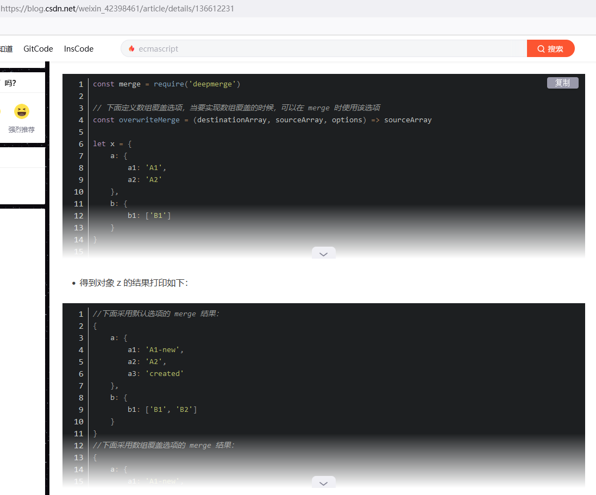
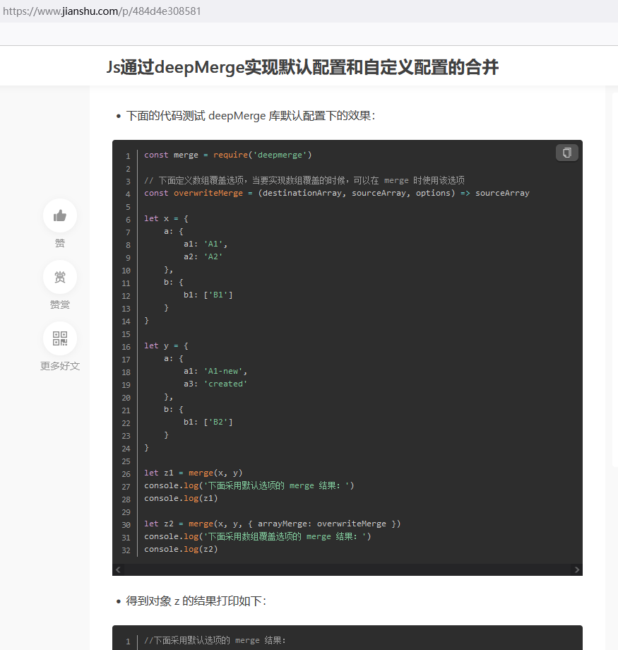
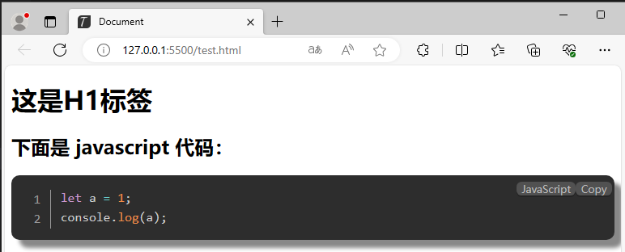
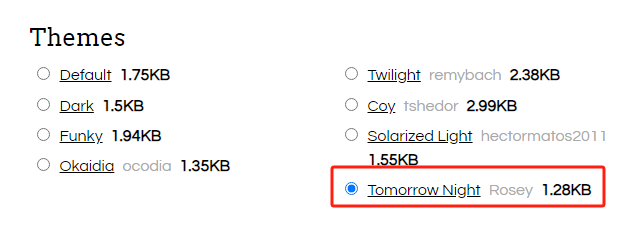
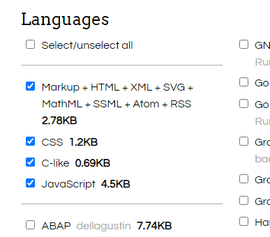
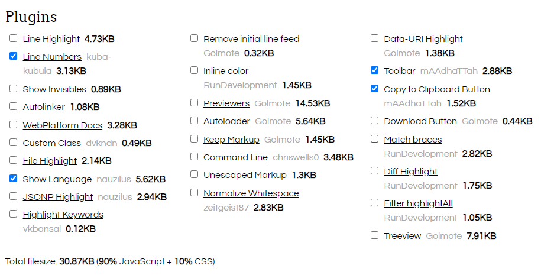
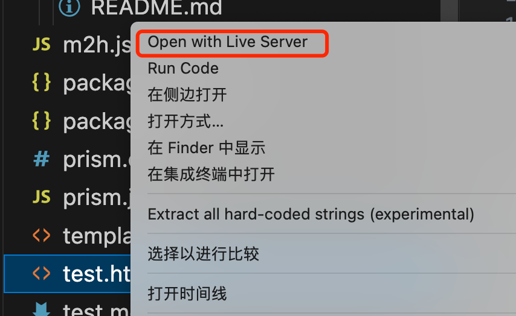

# Node下几十行代码实现炫酷的Markdow转HTML效果

> 经过一个阶段测试，终于找到两个 markdown 转 html 并实现代码高亮的工具，并以最简代码（几十行）实现了炫酷的展示效果。步骤很少，也很简单，零基础也应该一看就会。往下看吧......，需要安装有Node环境哦！

## 1 缘起

因为markdown 文档编辑器具有语法简单、文件简洁、标准化、使用广泛等特点，所以一直习惯采用 markdown 编辑器写文章，但仍有一些网站不支持 markdown 编辑器，想尝试将 markdown 转成 html 再发布，采用 Javascript 来实现，尤其想达到 CSDN 博客、简书这样的展示效果。
<center>图1  CSDN 博客 markdown 文章及代码块高亮效果</center>

<center>图2  简书 markdown 文章及代码高亮效果</center>

## 2 插件选择及应用模式

### 2.1 插件选择

#### 2.1.1 markdown 转 html 插件

比较常用的 M2H 插件有：

- Markdown-it
  中文：[https://markdown-it.docschina.org/](https://markdown-it.docschina.org/)
  github：[https://github.com/markdown-it/markdown-it](https://github.com/markdown-it/markdown-it)
- Marked
  官网：[https://marked.js.org/](https://marked.js.org/)
  github：[https://github.com/markedjs/marked](https://github.com/markedjs/marked)

从网上获得的 markdown-it 和 marked 的比较，主要表现在：在性能、使用简单程度、正则解析（中文支持）方面，marked 比较好；在扩展性上，markdown-it 表现则更好一些。
由于 markdown 应用比较成熟，而且一般使用也不会太复杂，所以选择性能好、中文支持好的 marked，至于 marked 的扩展性，也尝试了一下，满足常见的应用是没问题的。

#### 2.1.2 代码块高亮模块

代码块高亮插件有：

- heiglightjs
  官网：[https://highlightjs.org/](https://highlightjs.org/)
  github：[https://github.com/highlightjs/highlight.js](https://github.com/highlightjs/highlight.js)
- prismjs
  官网：[https://prismjs.com/](https://prismjs.com/)
  github：[https://github.com/PrismJS/prism](https://github.com/PrismJS/prism)

对 heiglightjs 和 prismjs 分别做了简单测试，发现 prismjs 使用非常简单，易于上手，且代码精简，效率高，而 heiglightjs  相对比较复杂，使用起来不习惯，也许是各人喜好不同吧。所以选择使用 prismjs 插件。

### 2.2 插件应用模式

M2H 一般有两种应用模式：一种是前端渲染，如在 vue 中使用；另一种是在后端生成 html 文件，在浏览器展示，如在 node 中使用。
此处我选择在 node 中生产静态 html 文件的应用模式，用户可以在电脑端当作 markdown 转 node 的工具使用； 至于前端渲染，vue 页面打包时总会包含一个 chunk-vendors.js 文件，会引起页面加载变慢，有很多办法压缩该文件，但这已经超出了 M2H 的范畴了，在此不再赘述。

## 3 计划实现的功能

- 读取指定 mardown 文件（test.md），生成目标 html 文件（test.html）——测试 marked 插件解析及渲染功能
- html 文件根据代码块对应的语言进行高亮显示——测试 prismjs 插件的 language 语言包功能
- html 文件实现显示语言名称、“复制”按钮、行号——测试 prismjs 插件的 Plugins 功能
- 自定义代码块的显示样式修改——测试拓展功能
- 最终实现的界面如下图：
  <center>图3  最终实现的markdown 转化及代码块渲染效果</center>

## 4 编码实现

### 4.1 准备工作

#### 4.1.1 创建项目

创建目录：marked-prismjs，使用 vsCode 打开该目录。

#### 4.1.2 安装插件

在 vsCode 里的终端输入相关命令进行插件安装
1）安装 marked 插件

```bash
npm install marked --save
```

2）安装 prismjs

```bash
npm install prismjs --save
```

#### 4.1.3 下载 prismjs 的 css 和 js 文件

访问官网下载页：[https://prismjs.com/download.html](https://prismjs.com/download.html)

- 按下图选择 themes，我比较喜欢“Tomorrow Night” 这个主题，您可以根据自己的喜好选择
  <center>图4  themes 选项</center>

- Languages 选项，默认即可，如下图，其中包含 CSS、Javascript 语言
  <center>图5  编程语言包选项</center>

- Plugins 选项，可以根据功能需要选择，此处选择4个选项，依次为：行号、显示语言名称、工具条、复制到剪贴板的按钮，如下图：
  <center>图6  插件选项</center>

- 分别点击下图的“DOWNLOAD JS”和“DOWNLOAD CSS”按钮下载 prism.js 和 prism.css 到项目根目录下。
  
  #### 4.1.4 编写 markdown 测试文件
  
  编写 markdown 测试文件：test.md，内容如下：

\# 这是H1标签
\## 下面是 javascript 代码：
\```javascript
    let a = 1;
console.log(a);
\`\`\`

### 4.2 编写实现转换功能的 js 文件

创建 m2h.js 文件，内容为：

```javascript
const { marked } = require('marked') // 引入 marked 模块
const prism = require('prismjs') // 引入 prism 模块
const fs = require('fs') // 引入文件处理模块
const mdContent = fs.readFileSync('test.md', 'utf-8') // 读取 markdown 文件内容
// 下面是 marked 扩展功能，当节点（token）类型是代码（code）时，自定义渲染节点功能，及使用自定义的 renderer 函数来代替默认 renderer 函数，达到改写当前节点生成的 html 代码的样式
marked.use({
    extensions: [{
        name: 'code',   
        renderer(token) {
            if (token.type === 'code') {
                let codeHtml = `<pre class="language- round"><code class="language-`+token.lang+` line-numbers">`
                codeHtml+=Prism.highlight(token.text, Prism.languages.javascript, 'javascript')
                codeHtml+=`</code></pre>`
                return codeHtml
            }
        }
    }]
})
// 定义 html 文件头部代码
var htmlContent=`
<!DOCTYPE html>
<html lang="en">
<head>
    <meta charset="UTF-8">
    <meta name="viewport" content="width=device-width, initial-scale=1.0">
    <title>Document</title>
    <link rel="stylesheet" href="prism.css">
    <script src="prism.js"></script>
</head>
<style>
  .round {
    box-shadow: 10px 10px 5px #888888;
    border-radius: 10px;
  }
</style>
<body>
`
htmlContent += marked.parse(mdContent) // 叠加上 marked 生成的 html 代码
htmlContent+=`</body> // 叠加底部代码（补齐）
</html>`
fs.writeFileSync('test.html', htmlContent) // 将最终的 html 内容写入到文件 test.html
```

测试运行：

```bash
node m2h.js
```

每运行一次，就会重新生成新的 test.html 文件。

在 vsCode 里鼠标右键点击 test.html 文件，选择“Open with Live Server”，
<center>图7  Open with LiveServer</center>

会在浏览器里打开 test.html 页面，test.md 已经成功生成了 test.html，实现了代码块高亮、语言显示及拷贝按钮及行号。得到的最终结果如下图：

<center>图8  效果展示</center>
达到了当初计划实现的功能需求。

## 5 总结

> 以上通过简单的几十行代码就实现了如此炫酷的功能展示，体现了插件的强大功能，同时通过自定义扩展节点渲染函数，也展现了插件的灵活性和可扩展性。此次测试仅仅是个引子，后续会继续进行研究和测试，感兴趣请收藏、关注，方便共同学习、进步。