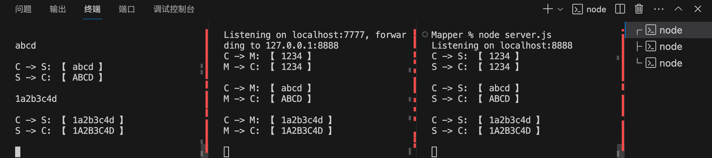

# Node实现TCP端口转发并截包的小工具
>近期我正致力于开发一个基于 Go-CQHTTP 的 QQ 机器人应用程序项目，该项目现已成功实现了 Go-CQHTTP 的容器化部署，利用 Docker 技术确保其运行环境的一致性与便捷性。随着项目推进，接下来的工作重心转向部署配套的签名服务器（qsign），同样采用 Docker 进行应用封装与管理。

>为了深入理解并有效监控 Go-CQHTTP 机器人与 qsign 服务间的通信交互，我计划运用 Node.js 编写一个专门的 TCP 端口转发与数据包截取工具。此工具不仅将助力调试当前项目中的通讯过程，确保二者间消息传递的准确无误，还因其通用性而有望成为日后调试其他基于 TCP 端口通信应用的理想辅助手段。

## 1 测试项目基本程序构成及端口设置
项目由3个js文件组成，都采用 net 模块来实现socker 通信。文件分别为：
- server.js
创建和启动一个 TCP 服务器，监听端口为：8888
- tcpMapper.js
创建一个 TCP 映射应用，包含：一个 TCP 服务端，监听端口为7777，用来接收客户端发送的数据；一个 TCP 客户端，远程连接server.js 监听的端口 8888
- client.js
创建一个 TCP 客户端，远程连接tcpMapper.js 监听的端口 7777

## 2 测试流程及实现功能：
- 为简化设计，此例不考虑客户端自动连接功能，所以需要注意 3 个 js 的运行顺序：先启动 server.js，再启动 tcpMapper.js，最后启动 client.js（每次调试都需要重新启动一遍，确保连接成功）
- 连接成功后，在 client.js 应用中输入任意字符串，通过 tcpMapper.js 转发到 server.js，server.js 将收到的数据转成大写后，再转发到 tcpMapper.js，tcpMapper.js 再转发到 client.js，最终在 client.js 中接收转换后的大写字符串。

## 3 程序代码
### 3.1 server.js
```bash
// 引入 net 模块
const net = require('net');

// 创建本地监听服务器
const server = net.createServer((serverSocket) => {
  
  // 获取本地服务端口接收到的数据
  serverSocket.on('data', (data) => {
    data=data.toString().trim();
    console.log(`C -> S: 【 ${data} 】`);

    // 将data转换为大写
    data = data.toString().toUpperCase();

    // 显示要发送给客户端的数据
    console.log(`S -> C: 【 ${data} 】\n`);

    // 通过 serverSocket 将数据发送给客户端
    serverSocket.write(`${data}`);
  });
})

// 启动本地监听服务器
server.listen(8888, () => {
    console.log(`Listening on localhost:${server.address().port}`);
});
```
### 3.2 tcpMapper.js
```bash
// 引入 net 模块
const net = require('net');

// 目标服务器信息
const targetHost = '127.0.0.1';
const targetPort = 8888;

// 创建本地监听服务器
const server = net.createServer((serverSocket) => {

  // 获取本地服务端口接收到的数据
  serverSocket.on('data', (data) => {
    console.log(`C -> M: 【 ${data} 】`);

    // 向远程服务器发送数据
    clientSocket.write(data);
  });

  // 创建一个客户端 Socket —— clientSocket，连接转发的服务器
  const clientSocket = new net.Socket();

  // 连接转发的目标服务器
  clientSocket.connect(targetPort, targetHost, () => {

    // 接收转发的目标服务器返回的数据
    clientSocket.on('data', (data) => {
      console.log(`M -> C: 【 ${data} 】\n`);

      // 向接入的客户端转发数据
      serverSocket.write(data);
    });

    // 错误处理
    ['error', 'end'].forEach((event) => {
      serverSocket.on(event, () => clientSocket.end());
      clientSocket.on(event, () => serverSocket.end());
    });
  });

  // 远程连接错误处理
  clientSocket.on('error', (err) => {
    console.error(`Error connecting to ${targetHost}:${targetPort}:`, err);
    serverSocket.destroy(err);
  });
});

// 启动本地监听服务器
server.listen(7777, () => {
  console.log(`Listening on localhost:${server.address().port}, forwarding to ${targetHost}:${targetPort}`);
});
```
### 3.3 client.js
```bash
// 引入 net 模块
const net = require('net');

// 目标服务器信息
const targetHost = '127.0.0.1';
const targetPort = 7777;

// 创建一个客户端 Socket —— clientSocket，连接目标服务器
const clientSocket = new net.Socket();
clientSocket.connect(targetPort, targetHost, () => {
    console.log(`连接成功! ${targetHost}:${targetPort}`)
})

// 监听目标服务器返回的数据
clientSocket.on('data', (data) => {
    console.log(`S -> C: 【 ${data.toString()} 】\n`);
})

// 键盘输入发送数据时
process.stdin.on('data', (data) => {
    data=data.toString().trim();
    console.log(`\nC -> S: 【 ${data} 】`);
    clientSocket.write(data);
})
```
## 4 调试方式
在 vscode 中，调试方式如下：

<center>图1  tcpMapper.js 的调试方式</center>
同时打开 3 个 vscode 终端，从右到左的顺序执行：server.js、tcpMapper.js、client.js，依次执行完之后，在运行 client.js 终端中输入任意字符串，回车后即可看到输出结果。
- C -> S 表示客户端发送给服务器的数据，客户端并不知道 tcpMapper 的存在
- S -> C 表示服务器转发给客户端的数据，服务器端也不知道 tcpMapper 的存在
- C -> M 表示客户端转发给 tcpMapper 的数据，M -> C 表示 tcpMapper 转发给客户端的数据。tcpMapper 知道客户端和服务器的存在

## 5 总结

tcpMapper.js 作为一个 JavaScript 库，已经成功实现了 TCP 端口转发与数据包截取两大核心功能。然而，当前版本的 tcpMapper.js 在设计与实现上尚未充分关注系统的健壮性建设，故其定位更倾向于作为一种简易实用的工具，用于快速解决特定场景下的端口转发与数据包处理需求，而非面向复杂环境或高可用性要求的应用。


