> Composer 是一个 PHP 的依赖管理工具。我们可以在项目中声明所依赖的外部工具库，Composer 会帮你安装这些依赖的库文件，有了它，我们就可以很轻松的使用一个命令将其他人的优秀代码引用到我们的项目中来。
## 1 Composer 简介
<center>图1  Composer ——一个神奇的“作曲家”</center>
### 1.1 Composer 中文是什么意思?
Composer 中文的意思是创作者、作曲者、作曲家；通常情况下，我们所说的 Composer 是 PHP 中用来管理依赖（dependency）关系的工具。你可以在自己的项目中声明所依赖的外部工具库（libraries），Composer 会帮你安装这些依赖的库文件。
### 1.2 Composer 是什么？
- Composer 是 PHP5.3 以上 的一个依赖管理工具。它允许你声明项目所依赖的代码库，它会在你的项目中为你安装他们。
- Composer 不是一个包管理器，虽然它涉及 "packages" 和 "libraries"，但它在每个项目的基础上进行管理，在你项目的某个目录中（例如 vendor）进行安装。默认情况下它不会在全局安装任何东西。因此，这仅仅是一个依赖管理。Composer 可运行在 Windows 、 Linux 以及 OSX 平台上。
## 2 Compsoer 相关站点
### 2.1 Composer
- 官方网址：[https://getcomposer.org](https://getcomposer.org)
- 中文网站：[https://www.phpcomposer.com](https://www.phpcomposer.com)
- 官方文档：[https://docs.phpcomposer.com](https://docs.phpcomposer.com)
### 2.2 Packagist
Packagist 是 Composer的组件仓库。
- 仓库地址：[https://packagist.org](https://packagist.org)
### 2.3 Packagist 中国全量镜像
中国全量镜像：[https://pkg.xyz](https://pkg.xyz)
## 3 composer 的安装
### 3.1 下载 Windows 下的安装文件
进入官网英文站点：https://getcomposer.org，windows下可以使用 Composer-setup.exe 来安装
下载：
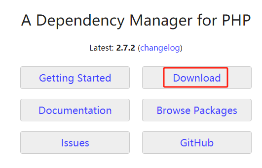<center>图2  Composer 官网下载入口</center>
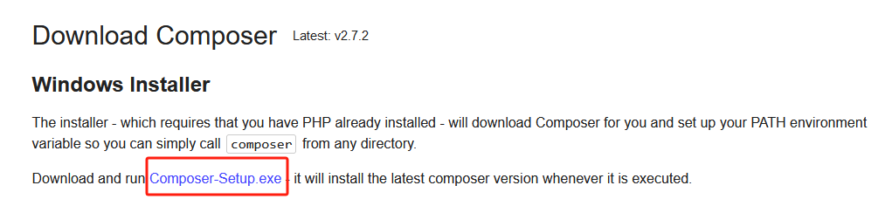<center>图3  下载 windows 下安装文件 Composer-Setup.exe</center>
### 3.2 安装
运行 Composer-setup.exe 安装
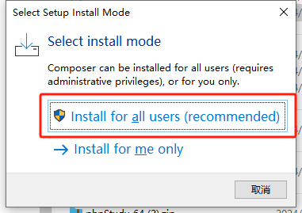<center>图4  选择推荐安装</center>
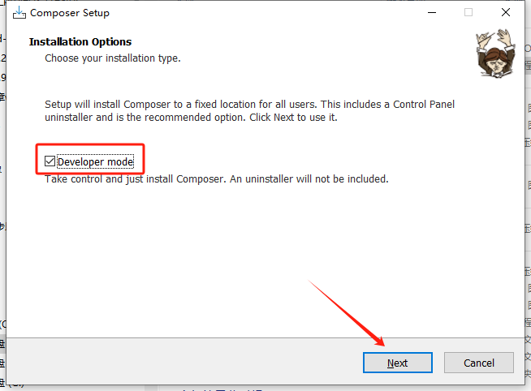<center>图5  选择开发者模式</center>
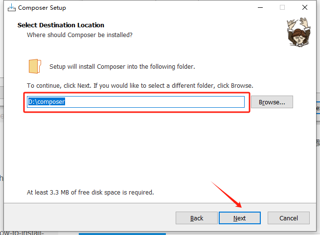<center>图6  选择安装目录</center>
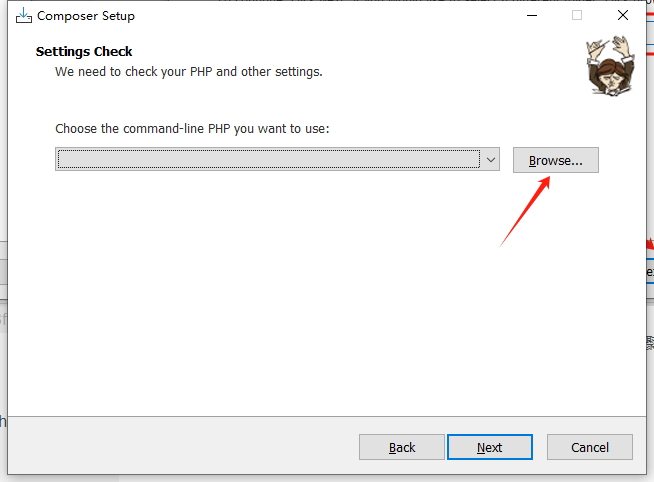<center>图7  选择 PHP 执行文件路径（这个很重要）</center>

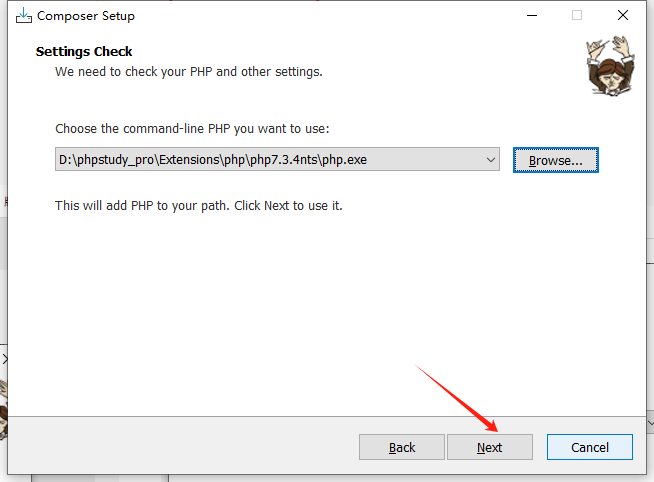<center>图8  选择正确的 PHP 执行文件路径（这个很重要）</center>
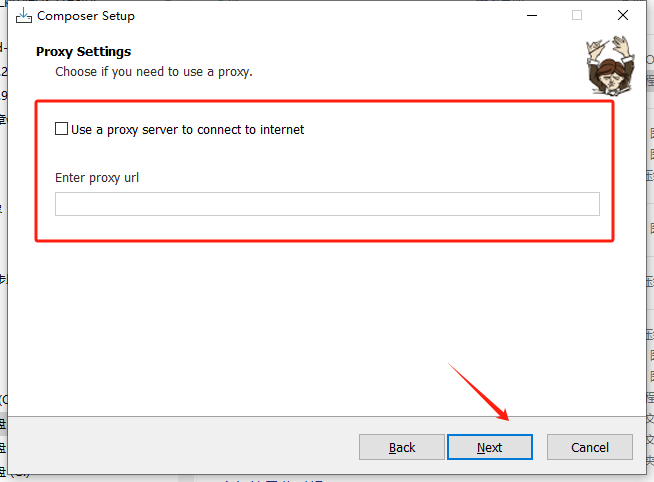<center>图9  按默认设置，不用选择代理</center>
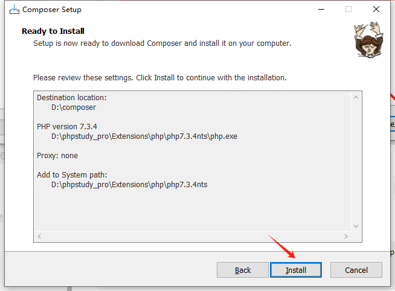<center>图10  继续安装</center>
继续安装，直至 Finished。
### 3.3 测试运行
重新打开一个 cmd 窗口，执行：
```bash
composer --version
```
返回 Composer 的版本号，Composer 安装配置完成！
## 4 Composer 的升级
如果你的系统中已经有可以正常使用的 Composer 了，说明系统环境是符合要求的，那么只需要下载新的 Composer 文件并覆盖原来的文件即可。
下载地址：[https://install.phpcomposer.com/composer.phar](https://install.phpcomposer.com/composer.phar)。
将下载的 composer.phar 文件覆盖系统中已经安装的 composer.phar 文件即可。注意，有可能在安装时将 composer.phar 改名为 composer 了，注意改成系统已经安装的同名文件覆盖即可。
## 5 修改Composer 的镜像配置
Composer 默认使用官方的组件库服务器地址：[https://repo.packagist.org/](https://repo.packagist.org/)。
### 5.1 常用国内Composer 镜像配置
由于网络原因，有时下载非常慢，就可以换成国内的组件库服务器镜像地址，分别用下面的命令进行配置：
- 中国全量镜像：
```bash
composer config -g repos.packagist composer https://mirrors.tencent.com/composer
```
- 腾讯云：
```bash
https://mirrors.cloud.tencent.com/composer
```
- 阿里云：
```bash
composer config -g repo.packagist composer https://mirrors.aliyun.com/composer/
```
上面几个镜像可以根据使用效果选择，哪个快且稳定，就选哪个。
### 5.2 显示当前镜像
使用下面的命令显示当前镜像：
```bash
composer config -g --list --verbose
```
这个命令会列出全局 Composer 配置，并包含 Composer 使用的镜像地址信息。
### 5.3 解除镜象：
```bash
composer config -g --unset repos.packagist
```
运行上面的命令后，就会清除设定的镜像设置，继续使用默认的组件包地址。
## 6 Composer 体验
安装完成 Composer，想试试到底有什么效果，我们以安装 lumen 框架为例，马上体验一下。
### 6.1 使用 windows 命令行工具，任意选择一个合适的目录，运行下面一条指令：
```bash
composer create-project --prefer-dist laravel/lumen lumen8.rest.api "8.1.1"
```
Composer 连接到服务器，下载 laravel/lumen v8.1.1 版的框架代码，放到自动创建的 lumen8.rest.api 目录下。
### 6.2 使用 PhpStudy 创建测试站点
PhpStudy 的安装、创建站点请参考我以前写的博客《[PhpStudy让电脑秒变多站点Web服务器](https://blog.csdn.net/weixin_42398461/article/details/136746775) 》的第四部分 “[4 PhpStudy 的基本应用](https://blog.csdn.net/weixin_42398461/article/details/136746775#t3)”。使用 PhpStudy 创建测试站点：
- 域名：lumen8.rest.api
- 根目录：xxxx/lumen8.rest.api<font color="red">（注意：xxxx 为创建项目时所在目录的绝对地址）</font>
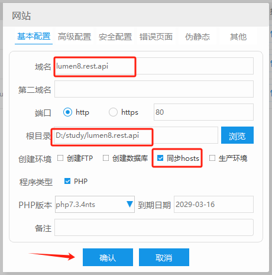<center>图11  配置新建立的网站</center>

点击“确认”按钮完成测试网站的搭建。
### 6.3 浏览器访问测试网站
在浏览器里输入地址：http://lumen8.rest.api
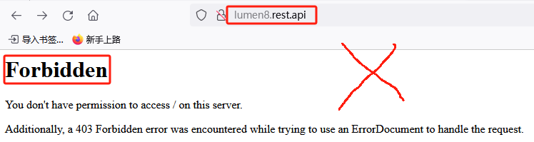<center>图12 :-( 禁止访问 :-(</center>
禁止访问的原因：网站根目录下没有 index.php、index.html 等默认首页文件造成的。为什么根目录下没有这些文件呢？这是和 Lumen 框架的设计原理有关的，其实有很多框架都有类似的规则，就是首页都是放到 public 或 public_html 等文件夹下，需要用 .htaccess 的 RewriteRule（及Rewrite规则）来实现此类框架的正常访问，此模式的应用和 Composer 无关，以后在正式进行 Lumen 开发时再讨论。
目前可以先访问地址：http://lumen8.rest.api/public，页面返回内容如下：
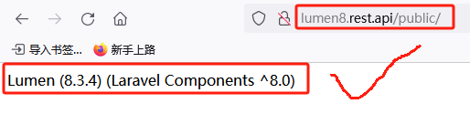<center>图13   Composer 成功部署第一个项目</center>
收到上面的 Lumen 版本信息即表示测试网站部署成功！
## 7 总结
使用 Composer 应用框架来创建项目、引入第三方组件包变得非常方便，同时在进行代码版本管理时，不用管理组件包里的代码，只需要保存好依赖配置文件 “composer.json”就可以了，在大量使用第三方组件来扩充功能的同时，还大大简化了代码版本管理，提升了开发效率。 

