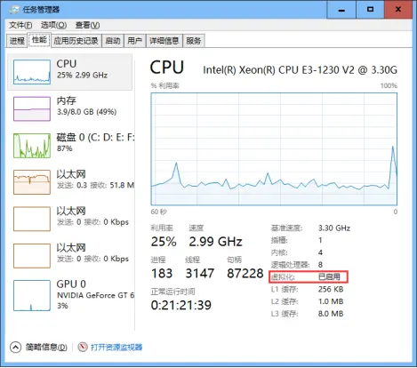
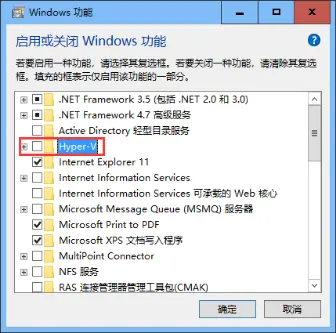
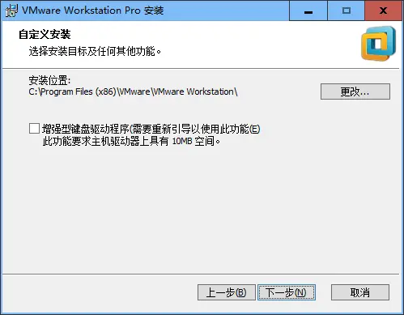
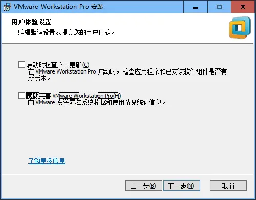
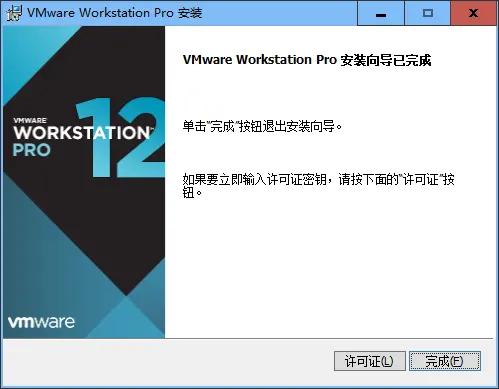
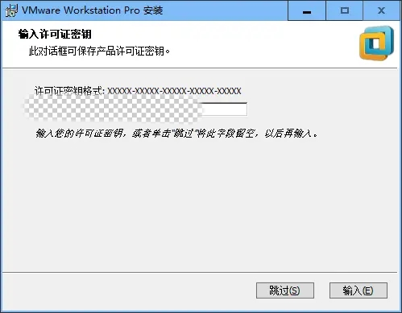
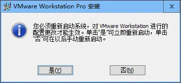

# Docker搭建LNMP环境实战（02）：Win10下安装VMware
## 1、基本环境检查
### 1.1、本机Bios是否支持虚拟化
进入：任务管理器- 性能，查看“虚拟化”是否启用，如果已启用，则满足要求，如果未启用，请在bios里进行设置：

检查本机Bios是否支持虚拟化

上图检测结果，我的电脑是支持虚拟化的。

### 1.2、Hyper-V是否禁用
《应用和功能》-《程序和功能》-《启用或关闭Windows功能》，出现下图：

检测Hyper-V是否禁用

不要勾选Hyper-V，可能会要求重启计算机。

## 2、下载安装VMware
- 安装包

为了可靠起见，安装的是WMware WorkStation pro，文件名为：VMware-workstation-full-12.5.7-5813279.exe；

可以网上搜，也可以直接从下面的百度云盘共享链接下载：[https://pan.baidu.com/s/1fCVL0pB0czx50K6L_uo2Zw](https://pan.baidu.com/s/1fCVL0pB0czx50K6L_uo2Zw)

- VMware 12 Pro 永久许可证激活密钥：

5A02H-AU243-TZJ49-GTC7K-3C61N

VF5XA-FNDDJ-085GZ-4NXZ9-N20E6

UC5MR-8NE16-H81WY-R7QGV-QG2D8

ZG1WH-ATY96-H80QP-X7PEX-Y30V4

AA3E0-0VDE1-0893Z-KGZ59-QGAVF

- 开始安装：

此处采用默认安装，不用勾选

此步骤将默认勾选去掉

安装时没有点击检查新版本，将默认勾选的项目取消勾选，一路安装完毕。

安装完成

输入许可证

重启即可！

至此，VMware安装完毕！在下一步完成CentOS安装之后，再安装WMware Tools。
