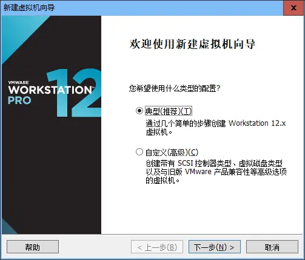
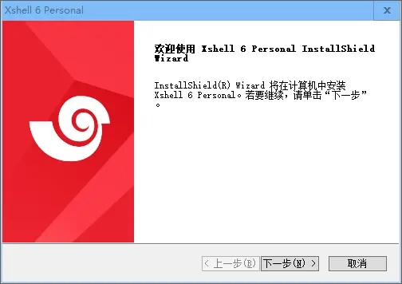

# Docker搭建LNMP环境实战（03）：VMware安装CentOS
## 1、创建新的虚拟机，选择CentOS7镜像文件，并启动安装
启动VMware，创建新的虚拟机

图1  选择典型安装即可

选用最大最全的CentOS镜像文件：CentOS-7-x86_64-Everything-1804.iso；安装版本可以到网上搜索，也可以从下面的百度云盘共享地址下载，下载，但由于百度云盘上传有单个文件的大小限制，所以使用压缩文件分卷压缩了：https://pan.baidu.com/s/1UZQJl5ebFq0a_Wz6BAMODw

图2  镜像文件选择

根据自己的习惯设置好虚拟机CentOS操作系统的安装位置

图3  设置CentOS操作系统的安装位置

一路yes，到CentOS安装窗口

图4  Install CentOS 7，一路回车

图5  选择中文-简体

图6  安装位置需要点击进入一下

图7  可不用修改，直接点击完成即可

图8  点击开始安装

图9  设置root用户密码

选择最小安装，不用安装图形界面即可满足使用。设置好root用户密码，并请牢记，可先不 “创建用户” 。后面有个较长时间的安装过程，请耐心等待。安装完成后请重启虚机，在虚拟机的CentOS窗口里输入用户名、密码登录即可。

## 2、设置虚拟机网络参数
### 2.1、调通内外网
不知道为什么，虚拟机网卡每次初始安装都不能自动上网

图10  ping 百度的网站和百度的地址均不成功

在删除默认网卡后，再添加一个新网卡，就可以ping通外网了！就是不知道原因，所以我就按我的方法进行安装了，有知道原因的朋友请指教，谢谢！

图11  移除默认网卡

图12  准备添加一个新网卡

图13  添加新网卡的操作

图14  新网卡的网络配置

测试一下：

图15  ping 外网

外网通了！
在虚拟机的shell里输入：ip addr，得到网络相关信息，如下：

图16  虚机的IP地址

其中inet后面的192.168.16.128即为该虚拟机的内部地址（图中是我安装后的地址，实际安装中会不同！），用Windows+R“cmd”的黑窗口测试一下：

图17  宿主机ping虚拟机

虚机可以被宿主机访问到，内网也通了！
### 2.2、将虚拟机设置为静态IP
到此，虚拟机的网络可以正常使用，但又发现一个问题，就是在以后多次重启虚拟机后，虚拟机的IP地址会自动变化，对于后续的使用造成很多不便，所以对虚拟机进行网卡配置，使用静态IP，这样IP就不会变动了。

图18  VMware主菜单 - 编辑 - 虚拟网络编辑器

图19  选择VMnet8网卡，点击“更改设置”按钮

图20  选中VMnet8，不勾选DHCP的选项

图21  设置VMnet8的NAT设置

图22  注意此处红框里的网关IP

- 记录好虚拟机网卡配置参数，备用：

IP地址：192.168.16.128

子网掩码：255.255.255.0

网关：192.168.16.2
- 进入虚拟机目录：/etc/sysconfig/network-scripts

找到网卡ens37的配置文件，如果没有则建立一个

编辑ens37的配置文件，在shell里输入命令行：vi ifcfg-ens37，配置文件的内容如下：

TYPE=Ethernet

PROXY_METHOD=none

BROWSER_ONLY=no

BOOTPROTO=static

DEFROUTE=yes

IPADDR=192.168.16.128

NETMASK=255.255.255.0

GATEWAY=192.168.16.2

DNS1=8.8.8.8

DNS2=114.114.114.114

IPV4_FAILURE_FATAL=no

IPV6INIT=yes

IPV6_AUTOCONF=yes

IPV6_DEFROUTE=yes

IPV6_FAILURE_FATAL=no

IPV6_ADDR_GEN_MODE=stable-privacy

NAME=ens37

UUID=d8d5d984-d163-4c69-aac6-97578ba8889d

DEVICE=ens37

ONBOOT=yes

其中UUID可以用下面命令生成：uuidgen ens37

- 配置宿主机网卡

图23  在Windows宿主机里配置VMnet8网卡

图24  完成配置

至此，网络设置完成！

## 3、安装配置xshell
VMware里的shell个人感觉非常难用，所以建议使用xshell进行虚拟机的管理，建议使用最新的xshell6。

### 3.1、xshell的下载和安装
xshell官网提供了个人和教育用的免费版本，只需要留个邮件就可以了，同时会限制同时打开的页面不超过5个，但个人用已经完全足够了。官网地址为：https://www.netsarang.com/zh/free-for-home-school/；也可以从下面的百度网盘分享地址直接下载：https://pan.baidu.com/s/1lyqRIAT4cYdignelu4UxzA；

点击下载的执行文件，出现安装欢迎界面

图25  欢迎界面

安装很简单没有悬念，基本上是一路“下一步”即可。

### 3.2、xshell的配置
运行xshell6，如果以前安装过老版本，会提示是否从老版本导入配置参数，课直接导入

图26  导入以前版本数据

为了更好地说明xshell的配置，不导入数据，从头开始进行用户配置。如果出现提示购买许可证的窗口，不用管，直接关闭就可以。在会话管理窗口新建会话：

图27  会话管理

图28  配置会话参数，点击确定保存

图29  连接会话

图30  保持密钥

图31  输入用户名，勾选“记住用户名”

图32  输入密码，勾选“记住密码”

点击确定，xshell就会成功连接到虚拟机了，可以在xshell里进行虚拟机的命令操作。注意：以后在CentOS系统里进行的shell操作，如无特殊说明，都是默认采用xshell来进行的。
