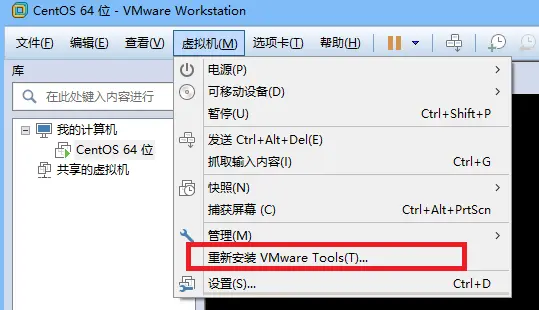
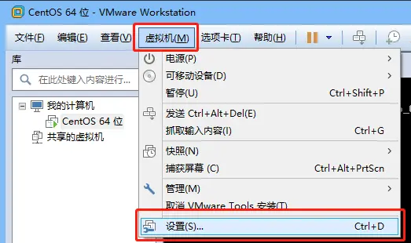
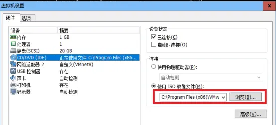
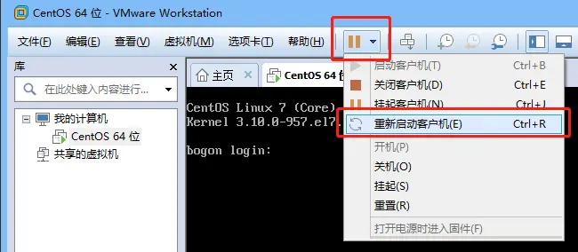
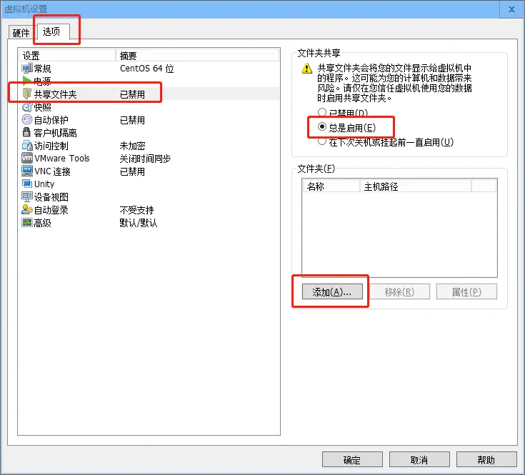
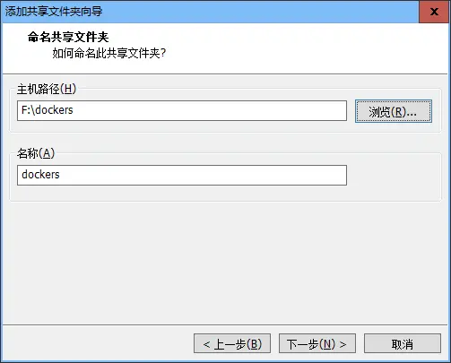
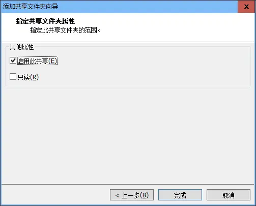
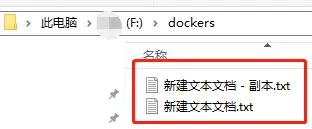
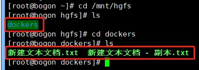

# Docker搭建LNMP环境实战（04）：安装VMwareTools共享文件夹
## 1、加载VMware Tools安装盘

在VMware客户端，点击主菜单：

  

图1  启动VMware Tools安装

再点击下面的菜单：

  

图2  打开设置界面

出现下面的界面，虚拟DVD加载的是linux.iso

  

图3  查看VMware Tools的DVD虚拟安装映像文件

将DVD加载到CentOS的系统里：

cd /mnt

mkdir cdrom

mount /dev/cdrom /mnt/cdrom

## 2、安装VMware Tools

将cdrom里的安装文件拷贝到当前用户目录下：

cd ~

cp /mnt/cdrom/VMwareTools-10.1.6-5214329.tar.gz .

注意：上面的拷贝命令最后两个字符为：空格和一个点。

解压拷贝后的压缩文件：

tar -zxvf VMwareTools-10.1.6-5214329.tar.gz

进入解开的目录里：

cd vmware-tools-distrib

下面开始安装环境：

yum -y install perl gcc kernel-devel

yum -y upgrade kernel kernel-devel

yum -y install net-tools.x86_64

安装完毕后，重启一下虚拟机：

  

图4  重新启动客户机

重启后，在shell里运行下面的命令，进行VMware Tools安装：

cd ~/vmware-tools-distrib

./vmware-install.pl

在此安装过程中，不管出现什么选项，比如[yes]、[no]、[路径]，全部都回车即可。

到这里，VMware Tools就安装完成了。

## 3、设置虚拟机共享文件夹

点击进入虚拟机设置菜单：

  

图5  打开设置界面

在选项页里选中共享文件夹选项，选择总是启用单选，点击添加按钮

  

图6  虚拟机设置共享文件夹选项

选择宿主机（Windows）下需要共享的文件夹（此处为：F:\dockers，用户可以根据需要自己选择），名称可以修改，也可以不改。

  

图7  添加共享文件夹

点击下一步

  

图8  启用共享，并且可以读写

保持默认选项，点击完成即可。重启虚拟机，随后可以查看结果。

Windows宿主机的共享目录及内容如下图所示：

  

图9  Windows共享目录内容

在shell里输入：

cd /mnt/hgfs

ls

  

图10  CentOS虚拟机对应的目录内容

CentOS虚拟机里/mnt/hgfs目录为共享文件夹的根目录，所有共享文件夹都会在该目录下，从列举的文件可以看出，Windows的共享目录和虚拟机里的对应目录内容完全一样。这样就可以在以后的开发中，实现在Window宿主机里直接修改CentOS虚拟机里的文件了。
