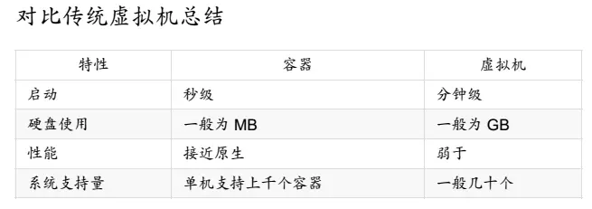
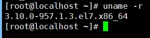
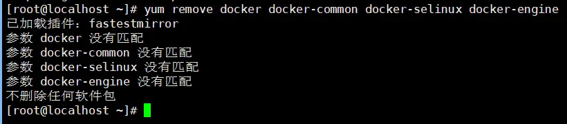
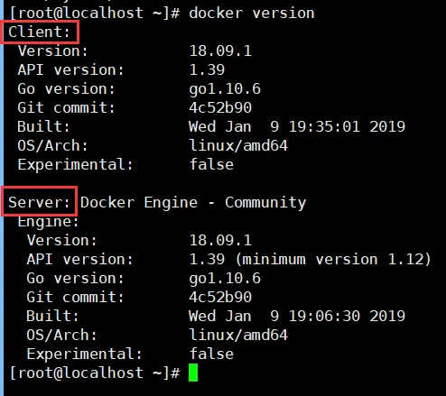

# Docker搭建LNMP环境实战（05）：CentOS环境安装Docker-CE
前面几篇文章讲了那么多似乎和Docker无关的实战操作，本篇总算开始说到Docker了。

## 1、关于Docker

### 1.1、什么是Docker

Docker概念就是大概了解一下就可以，还是引用一下百度百科吧：

Docker 是一个开源的应用容器引擎，让开发者可以打包他们的应用以及依赖包到一个可移植的容器中，然后发布到任何流行的[Linux](https://baike.baidu.com/item/Linux)机器上，也可以实现虚拟化，容器是完全使用沙箱机制，相互之间不会有任何接口。

一个完整的Dockery由以下几个部分组成：

- dockerClient客户端

- Docker Daemon守护进程

- Docker Image镜像

- DockerContainer容器

### 1.2、为什么要使用Docker

作为一种新兴的虚拟化方式，Docker跟传统的虚拟化方式相比具有众多的优势。

- 更高效的利用系统资源

由于容器不需要进行硬件虚拟及运行完整操作系统等额外开销，Docker对系统资源的利用率更高。无论是应用执行速度、内存损耗或者文件存储速度，都要比传统的虚拟机技术更高效。因此，相比虚拟机技术，一个相同配置的主机，往往可以运行更多数量的应用。

- 更快速的启动时间

传统的虚拟机技术启动应用服务往往需要数分钟，而Docker容器应用，由于直接运行与宿主内核，无需启动完整的操作系统，因此可以做到秒级、甚至毫秒级别的启动时间。大大的节约了开发、测试、部署的时间。

- 一致的运行环境

开发过程中一个常见的问题是环境一致性问题。由于开发环境、测试环境、生产环境不一致，导致有些BUG并未在开发过程中被发现。而Docker的镜像提供了除了内核外完整的运行时环境，确保了应用运行环境得一致性，从而不会再出现“这段代码在我机器上没问题”这类问题。

- 持续交付和部署

对开发和运维人员来说，最希望的就是一次性创建或配置，可以在任意地方正常运行。

使用Docker可以通过定制应用镜像来实现持续集成、持续交付、部署。开发人员可以通过DockerFile来进行镜像构建，并结合 持续集成系统进行集成测试，而运维人员则可以直接在生产环境中快速部署该镜像，甚至结合持续部署系统进行自动部署。

而使用DockerFile使镜像构建透明化，不仅仅开发团队可以理解应用运行环境，也方便运维团队理解应用运行所需条件，帮助更好的生产环境中部署该镜像。

- 更轻松的迁移

由于Docker确保了执行环境得一致性，使得应用的迁移更加容易。Docker可以在很多平台上运行，无论是物理机、虚拟机、公有云、私有云，甚至是笔记本，其运行结果是一致的。因此用户可以很轻易的将在一个平台上运行的应用迁移到另一个平台，而不用担心运行环境得变化导致应用无法正常运行的情况。

- 更轻松的维护和扩展

Docker使应用的分层存储以及镜像的技术，使得应用重复部分的复用更为容易，也使得应用的维护更新更加简单，基于基础镜像进一步扩展镜像也变的非常简单。此外，Docker团队同各个开源项目团队一起维护了一大批高质量的官方镜像，既可以直接在生产环境使用，又可以作为基础进一步定制，大大的降低了应用服务的镜像制作成本。

  

<center>图1  Docker vs 传统虚拟机</center>

摘自《Docker从入门到实践》。

### 1.3、Docker版本分类

Docker分为CE版本和EE版本，区别如下：

- Docker社区版（CE）：为了开发人员或小团队创建基于容器的应用,与团队成员分享和自动化的开发管道。docker-ce提供了简单的安装和快速的安装，以便可以立即开始开发。docker-ce集成和优化，基础设施。（免费） 

- Docker企业版（EE）：专为企业的发展和IT团队建立谁。docker-ee为企业提供最安全的容器平台，以应用为中心的平台。（付费）

我们使用CE版本即可，即Docker-CE。

- Docker-CE有windows版本，我也安装过，但是有太多莫名其妙的问题，确实无法使用，所以就尝试在虚拟机的CentOS里使用Docker-CE，效果非常棒，这也就是我前面会花那么多篇幅来写Windows下安装CentOS的原因。这样初学者不用再翻各种资料来进行尝试，确保一气呵成。哈哈！

## 2、安装Docker-CE（请先按步骤体验一下安装过程，文章末尾会追加自动化安装脚本）

docker安装的有些步骤我也不是很明白，从网上查到相关知识，通过实战安装发现可行，就OK了。

### 2.1、Docker版本检查

docker要求CentOS 系统的内核版本高于 3.10 ，安装之前首先要验证你的CentOS 版本是否支持 Docker 。

通过uname -r 命令查看你当前的内核版本（建议使用xshell连接虚拟机进行命令操作）：
```bash
 $ uname -r
```
  

<center>图2  CentOS内核版本查看</center>

CentOS内核版本没有问题

### 2.2、更新系统

使用root 权限登录 CentOS。确保 yum 包更新到最新。
```bash
$ yum -y update
```
### 2.3、卸载旧版本（如果安装过就版本的话）
```bash
$ yum remove docker docker-common docker-selinux docker-engine
```
如果安装过旧版本，就会卸载当前版本；如果没安装过，运行上面的命令也没关系，只是提示未安装

  

<center>图3  卸载旧版本</center>

比较干净，没有需要删除的历史docker。

### 2.4、安装需要的软件包

yum-util 提供yum-config-manager功能，另外两个是devicemapper驱动依赖的
```bash
$ yum install -y yum-utils device-mapper-persistent-data lvm2
```
### 2.5、设置yum源，清华镜像仓库，速度很快
```bash
yum -y install wget #如果没有安装wget则安装，如已安装则会跳过
```
#根据你的发行版下载repo文件:
```bash
$ wget -O /etc/yum.repos.d/docker-ce.repo https://download.docker.com/linux/centos/docker-ce.repo
```
#把软件仓库地址替换为 TUNA:
```bash
sed -i 's+download.docker.com+mirrors.tuna.tsinghua.edu.cn/docker-ce+' /etc/yum.repos.d/docker-ce.repo
```
### 2.6、安装docker
```bash
$ yum makecache fast # 清缓存
$ yum install docker-ce  # 安装docker-ce
```
### 2.7、启动并加入开机启动
```bash
$ systemctl start docker
$ systemctl enable docker
```
### 2.8、验证安装是否成功

如果有client和service两部分，则表示docker安装启动都成功了
```bash
$ docker version
```
  

<center>图4  检查docker版本</center>

## 3、安装Docker Compose

以前使用 Docker 的时候，需要定义 Dockerfile 文件，然后使用 docker build、docker run 等命令操作容器。然而微服务架构的应用系统一般包含若干个微服务，每个微服务一般都会部署多个实例，如果每个微服务都要手动启停，那么效率之低，维护量之大可想而知。

使用 Docker Compose 可以轻松、高效地管理容器，他是一个用于定义和运行多容器Docker的应用程序工具。

### 3.1、运行命令下载 docker compose

# 从国内镜像 get.daocloud.io 快速下载：
```bash
curl -L https://get.daocloud.io/docker/compose/releases/download/1.23.2/docker-compose-`uname -s`-`uname -m` > /usr/local/bin/docker-compose
```

注意：我多次尝试从上面的地址下载 docker-compose， 一直没有成功，所以将 docker-compose 文件上传到了github，放到安装脚本 install-docker.sh 同级目录下，可一起打包下载到安装目录下，对 install-docker.sh 文件做了相应修改。具体可到我的 github 上获取，项目地址为：[https://github.com/tanbushi/install-docker](https://github.com/tanbushi/install-docker)。

### 3.2、给执行文件添加执行权限
```bash
chmod +x /usr/local/bin/docker-compose
```
### 3.3、输入命令测试
```bash
docker-compose --version
```
返回：
```bash
docker-compose version 1.22.0, build f46880fe
```
docker compose 安装成功！

### 3.4、配置docker国内镜像

为了确保docker能快速加载应用程序镜像，配置镜像列表，指向国内的镜像地址。

修改 /etc/docker/daemon.json 文件并添加上 registry-mirrors 键值。
```json
{
  "registry-mirrors": ["https://registry.docker-cn.com"]
}
```
修改保存后重启 Docker 以使配置生效。
```bash
systemctl restart docker
```
至此，docker环境安装完毕！

## 4、自动化安装的脚本（后续我的项目都会编制相应的脚本，便于安装和维护）

体验过整个安装过程后，是不是觉得有些麻烦？是的，命令行模式一步步执行确实很啰嗦，还不好记。所以，我为大家准备了全自动化的安装脚本，并已经上传到了github，请到github拉取试用！github地址为：[https://github.com/tanbushi/install-docker](https://github.com/tanbushi/install-docker)

拉取文件后，可以将 install-docker.sh 上传到虚拟机CentOS的任意目录里，或者将 install-docker.sh 拷入上一篇文章所建立和映射的共享文件夹下（文章里的示例路径为：F:\dockers），文章请参考：Docker搭建LNMP环境实战（04）：安装VMware Tools共享文件夹；在虚拟机CentOS里的 /mnt/hgfs/dockers 里访问到 install-docker.sh。

给脚本 install-docker.sh 增加可执行权限
```bash
$ chmod +x install-docker.sh
```
执行 install-docker.sh 脚本文件
```bash
$ ./install-docker.sh
```
即可自动完成 docker 及 docker-compose 的安装！Good Lucky！

## 5、自动化卸载docker的脚本

在github地址为：[https://github.com/tanbushi/install-docker](https://github.com/tanbushi/install-docker) 的项目里有个uninstall_docker.sh，可以和install.sh进行类似处理

执行 install-docker.sh 脚本文件
```bash
$ ./uninstall-docker.sh
```
即可自动完成 docker 的卸载！
