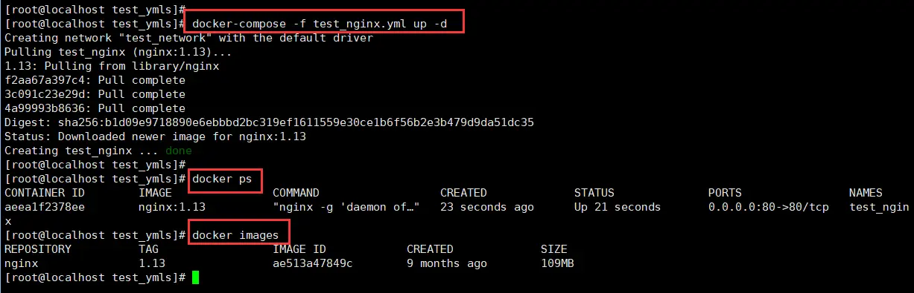

# Docker搭建LNMP环境实战（06）：Docker及Docker-compose常用命令

此处列举了docker及docker-compose的常用命令，一方面可以做个了解，另一方面可以在需要的时候进行查阅。不一定要强行记忆，用多了就熟悉了。
## 1、docker常用命令

### 1.1、镜像常用命令

**1）列举镜像**
```bash
docker images
```

**2）删除镜像**
```bash
docker rmi xxxxxx（image_id）
```

**3）使用repositories:tag进行删除**
```bash
docker rmi nginx:1.15
```

### 1.2、容器常用命令

**1）列举所有容器**
```bash
docker container ls -a
```

**2）列举正在运行的容器**
```bash
docker container ls（另一种用法：docker ps）
```
  
<center>图1  列举正在运行的容器</center>

**3）启动一个容器**
```bash
docker container start xxxxxxx（container_id）

```

**4）停止一个容器**
```bash
docker container stop xxxxxxx（container_id）
```

**5）删除一个容器**
```bash
docker container rm xxxxxxx（container_id）
```

**6）进入容器内部**
```bash
docker exec -it CONTAINER_NAME /bin/bash
```

**7）查看容器log**
```bash
docker logs xxxxxxx（container_id）
```

## 2、docker-compose常用命令

**1）启动部署**

- 指定yml文件的模式：
```bash
docker-compose -f ymlfilename.yml up -d #ymlfilename.yml是你编写的配置文件
```
- 默认yml文件的模式：
```bash
docker-compose up -d  #此命令表示采用默认的配置文件，等同于：docker-compose -f docker-compose.yml up -d
```
注意：yml后缀和yaml后缀是等同的；-d 表示后台运行

**2）停止并删除容器**

- 指定yml文件的模式：
```bash
docker-compose -f ymlfilename.yml down #ymlfilename.yml是你编写的配置文件
```
- 默认yml文件的模式：
```bash
docker-compose down  #此命令表示采用默认的配置文件，等同于：docker-compose -f docker-compose.yml down
```
## 3、关于 docker-compose 配置文件的简要说明

此实战中，主要是使用 docker-compse 配置文件的编排来完成 LNMP 环境的部署，由于不是 docker 基础教程，所以只对使用到的最关键的特性进行简要说明，并不系统和全面，在应用中遇到的其他问题，在实战的过程中涉及到的都会讲到，没讲到的问题可搜索相关文档参考。

**1）yml 文件的注释**
yml 文件的注释符为：#，# 及后面的字符都为注释

**2）yml 文件的版本**
yml 文件的大版本号目前为：3，最新的版本为：3.7；网上很多的示例还是采用版本2，由于我们在使用脚本来动态创建 yml 文件时，要求网卡的动态命名，但只有在3.5版本开始才支持该功能，所以，我这里选用的是 3.5 版本。
  
<center>图2  yml文件版本</center>

## 4、给一个最简示例，熟悉一下docker及docker-compose操作
示例docker的yml文件内容如下：
  
<center>图3  docker最简化安装nginx的yml示例文件</center>

**1）、利用三个命令检查一下docker环境及安装情况**
  
<center>图4  docker 相关查看命令</center>

从图中可以看到，docker-compose系统已经安装完毕，并且系统里没有任何已安装的容器和镜像

**2）编辑test_nginx.yml文件**
内容如下：
```yml
version: "3.5"
services:
    test_nginx:
        container_name: test_nginx
        image: nginx:1.13
        privileged: true
        restart: always
        networks:
            - test_network
        ports:
            - 80:80
        environment:
            - TZ=Asia/Shanghai
networks:
    test_network:
        name: test_network
```
由于yml文件的格式要求非常严格，如缩行要求、冒号后面是否有空格等都有要求，所以对于新手来说，手工输入十有八九会出很多问题，所以建议直接复制剪贴来生成文件。当然，也可以从github里下载，地址为：https://github.com/tanbushi/DNMP
将test_nginx.yml放到合适的目录下，并在shell里进入到该目录，下面就可以开始体验一下docker-compose的强大威力了。

**3）采用docker-compose进行安装**
  
<center>图5  docker-compose命令</center>

从上图可以看到，利用docker-compose命令启动安装，系统检测到没有对应的镜像，就会从镜像市场拉取镜像，并自动安装。利用docker ps命令可以看到容器已经生成并自动启动，利用docker images命令可以看到nginx镜像已经下载到系统。此安装仅仅作为体验测试，所以不具备实用性，后续会进行正式安装。

**4）测试nginx安装效果**
打开浏览器，输入CentOS虚拟机的网址：


<center>图6  测试安装成功！</center>

**5）docker删除操作测试**
  
<center>图7  docker删除容器和镜像</center>
