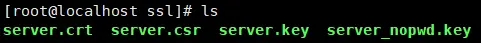

# Docker搭建LNMP环境实战（07）：安装nginx

## 1、模拟应用场景描述

假设我要搭建一个站点，假设虚拟的域名为：api.test.site，利用docker实现nginx+php-fpm+mariadb部署。

## 2、目录结构

### 2.1、dockers根目录

由于目前的安装是基于Win10+VMWare+CentOS虚拟机，同时已经安装了VMWareTools，并配置了虚拟目录，虚拟目录是仅仅是为了简化文件的传输，虚拟目录在CentOS里的全路径为：/mnt/hgfs/dockers，此目录为CentOS里的dockers根目录，读者可以根据需要自己指定dockers根目录。

### 2.2、演示项目目录结构

  

<center>图1  dockers演示项目目录结构</center>

## 3、安装nginx

### 3.1、windows环境下修改hosts文件，实现虚拟域名的解析

在文件夹C:\Windows\System32\drivers\etc下找到hosts文件，并编辑，加入一行：
```txt
192.168.16.128 api.test.site
```

保存即可。其中：192.168.16.128为我现在VMware虚拟机里的centos的ip地址，请读者改成`自己环境下的正确配置`。

### 3.2、编写nginx部署配置文件test_site_nginx.yml

在文件夹：/mnt/hgfs/dockers/test_site/compose下创建文件：test_site_nginx.yml，内容如下：


<center>图2  nginx 部署配置文件内容</center>

```yml
version: "3.5"
services:
    test_site_nginx:
        container_name: test_site_nginx
        image: nginx:1.13
        privileged: true
        restart: always
        networks:
            - test_site_network
        ports:
            - 80:80
            - 443:443
        volumes:
            - /mnt/hgfs/dockers/test_site/www:/var/test_site/www
            - /mnt/hgfs/dockers/nginx/conf.d:/etc/nginx/conf.d
        environment:
            - TZ=Asia/Shanghai
networks:
    test_site_network:
        name: test_site_network
```
### 3.3、站点默认页面及nginx支持HTTP协议访问的配置

**1）编辑生产index.html文件，**

进入目录： /mnt/hgfs/dockers/test_site/www；编辑生成index.html文件，内容为：
```html
hello world!!!!!! From index.html
```
**2）编辑生成nginx默认配置问default.conf**

进入目录：/mnt/hgfs/dockers/nginx/conf.d；编辑生产default.conf。内容为：
```
server {
    listen      80;
    server_name  api.test.site;
    location / {
        root  /var/test_site/www;
        index  index.html index.htm;
    }
    error_page  500 502 503 504  /50x.html;
    location = /50x.html {
        root  /var/test_site/www;
    }
}
```
**3）运行docker-compose命令进行部署**
```bash
docker-compose -f test_site_nginx up -d
```


<center>图3  docker-compose部署nginx</center>

**4）验证安装效果**

在浏览器里访问：http://api.test.site，返回结果如下：


<center>图4  验证通过http访问nginx 的80端口成功</center>

验证通过http协议访问nginx的80端口成功！

### 3.4、ssl证书的生成及nginx支持https协议访问的配置

#### 3.4.1、ssl证书的生成
```bash
cd /mnt/hgfs/dockers/nginx/ssl
```
**1）设置server.key**

这里需要设置两遍密码（自己随便选一个密码输入两次）:
```bash
openssl genrsa -des3 -out server.key 1024
```


<center>图5  生成server.kry</center>

会在当前目录下生成文件：server.key

**2）参数设置**

这里需要输入之前设置的密码:
```bash
openssl req -new -key server.key -out server.csr
```
由于是测试，可以随便输入一些信息就可以了，这样会生成文件：server.csr

**3）写RSA秘钥**

这里也要求输入之前设置的密码：
```bash
openssl rsa -in server.key -out server_nopwd.key
```
生成文件：server_nopwd.key，使用这个文件可以在应用时避免输入密码

**4）获取私钥:**

```
openssl x509 -req -days 365 -in server.csr -signkey server_nopwd.key -out server.crt
```
完成这一步之后就得到了我们需要的证书文件和私钥了：

  

<center>图6  ssl证书及私钥文件</center>

#### 3.4.2、配置nginx服务器，支持https访问

**1）修改yml文件**

修改test_site_nginx.yml文件，增加ssl目录的绑定

  

<center>图7  在yml文件里增加ssl目录绑定</center>

**2）修改配置文件default.conf，添加ssl支持**

 

<center>图8  修改配置文件default.conf，添加ssl支持</center>

红色框内为新增的配置项。修改后的文件内容如下：
```
server {
    listen      80;
    listen      443 ssl;
    server_name  api.test.site;
    #ssl on;
    ssl_certificate /etc/nginx/ssl/server.crt;
    ssl_certificate_key /etc/nginx/ssl/server_nopwd.key;
    # 指定密码为openssl支持的格式
    ssl_protocols  SSLv2 SSLv3 TLSv1.2;
    ssl_ciphers  HIGH:!aNULL:!MD5;  # 密码加密方式
    ssl_prefer_server_ciphers  on;  # 依赖SSLv3和TLSv1协议的服务器密码将优先于客户端密码
    location / {
        root  /var/test_site/www;
        index  index.html index.htm;
    }
    error_page  500 502 503 504  /50x.html;
    location = /50x.html {
        root  /var/test_site/www;
    }
}
```
**3）卸载和重新安装nginx**
```bash
cd /mnt/hgfs/dockers/test_site/compose
docker-compose -f test_site_nginx down
docker-compose -f test_site_nginx up -d
```
4）测试https访问

浏览器里输入：https://api.test.site，会出现问题，返回结果为：

  

<center>图9  https访问出现问题</center>

点击“高级”按钮，出现下面界面


<center>图10  高级选项后的界面</center>

点击红框中的链接  继续前往api.test.site，不知道什么原因，就是证书不对，但可以在“不安全”的模式下访问到首页：index.html，总算是可以访问了，也算基本成功吧！哪位有正确处理的方法，请赐教，谢谢。

  

<center>图11  不安全的模式访问成功</center>

