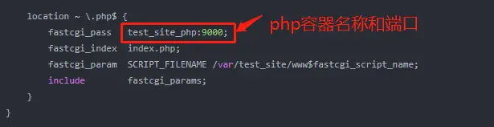
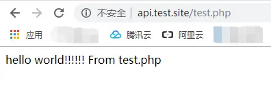
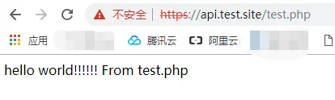

# Docker搭建LNMP环境实战（08）：安装php-fpm
## 1、编写php测试文件
在文件夹：/mnt/hgfs/dockers/test_site/www目录下创建文件：test.php，内容为：
```php
<?php
  echo "hello world!!!!!! From test.php";
?>
```
## 2、编写php-fpm部署配置文件
在文件夹：/mnt/hgfs/dockers/test_site/compose下创建文件：test_site_php.yml，内容如下：
```yml
version: "3.5"
services:
    test_site_php:
        container_name: test_site_php
        image: php:7.2.3-fpm
        privileged: true
        restart: always
        networks:
            - test_site_network
        volumes:
            - /mnt/hgfs/dockers/test_site/www:/var/test_site/www
        environment:
            - TZ=Asia/Shanghai            
networks:
    test_site_network:
        name: test_site_network
```
注意：此文件中网络的名称和nginx配置文件中网络的名称是相同的，都是：test_site_network
## 3、修改nginx配置文件，支持php
```conf
server {
    listen       80;
    listen       443 ssl;
    server_name  api.test.site;
	
    #ssl on;
    ssl_certificate /etc/nginx/ssl/server.crt;
    ssl_certificate_key /etc/nginx/ssl/server_nopwd.key;
    # 指定密码为openssl支持的格式
    ssl_protocols  SSLv2 SSLv3 TLSv1.2;
    ssl_ciphers  HIGH:!aNULL:!MD5;  # 密码加密方式
    ssl_prefer_server_ciphers  on;   # 依赖SSLv3和TLSv1协议的服务器密码将优先于客户端密码

    location / {
        root   /var/test_site/www;
        index  index.html index.htm;
    }

    error_page   500 502 503 504  /50x.html;
    location = /50x.html {
        root   /var/test_site/www;
    }
	
    location ~ \.php$ {
        fastcgi_pass   test_site_php:9000;
        fastcgi_index  index.php;
        fastcgi_param  SCRIPT_FILENAME /var/test_site/www$fastcgi_script_name;
        include        fastcgi_params;
    }
}
```
注意：最后一段为新加的修改

<center>图1  fastcgi_pass设置</center>

注意：此文件中网络的名称和php配置文件中网络的名称是相同的，都是：test_site_network
## 4、部署php和nginx
在shell里运行docker列表命令：
```bash
docker ps
```
由于修改了test_site_nginx.yml文件，所以如果test_site_nginx的docker容器存在，则先利用下面的命令卸载掉
```bash
cd /mnt/hgfs/dockers/test_site/compose
docker-compose -f test_site_nginx.yml down
```
按顺序启动test_site_php容器和test_site_nginx容器，由于nginx引用了php，所以先启动php，后启动nginx
```bash
docker-compose -f test_site_php.yml up -d
docker-compose -f test_site_nginx.yml up -d
```
## 5、测试访问网站
在浏览器里输入：http://api.test.site/test.php

<center>图2  http访问php测试页面</center>
成功！


在浏览器里输入：https://api.test.site/test.php

<center>图3  https访问php测试页面</center>
成功！

## 6、编写安装和卸载docker容器的脚本
编写一个简单的安装和卸载脚本，方便操作
**1）安装脚本：install.sh**
编辑install.sh文件，内容如下：
```bash
#!/bin/bash
#echo ""
echo "安装 php..."
docker-compose -f test_site_php.yml up -d
echo "php 安装结束！"
echo ""
echo "安装 nginx..."
docker-compose -f test_site_nginx.yml up -d
echo "nginx 安装结束！"
echo ""
```
修改执行权限：
```bash
chmod +x install.sh
```
**2）卸载脚本：uninstall.sh**
编辑uninstall.sh文件，内容如下：
```bash
#!/bin/bash
echo "卸载 nginx..."
docker-compose -f test_site_nginx.yml down
echo "nginx 卸载完成！"
echo ""
echo "卸载 php..."
docker-compose -f test_site_php.yml down
echo "php 卸载完成！"
echo ""
service docker restart # 为了保险起见，卸载完成后重启一下docker服务
```
修改执行权限：
```bash
 chmod +x uninstall.sh
```
## 7、测试脚本
```bash
cd /mnt/hgfs/dockers/test_site/compose
docker ps # 列举是否有容器在运行
./uninstall.sh # 有则卸载
./install.sh  # 安装
```
经测试，没有问题！

