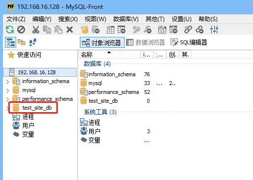
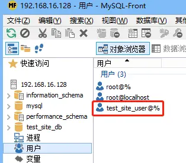
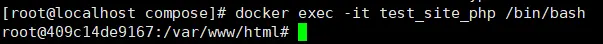
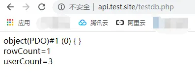
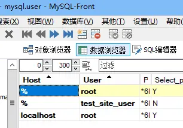

# Docker搭建LNMP环境实战（09）：安装mariadb
## 1、编写mariadb部署配置文件
在文件夹：/mnt/hgfs/dockers/test_site/compose下创建文件：test_site_mariadb.yml，内容如下：
```yml
version: "3.5"
services:
    test_site_mariadb:
        container_name: test_site_mariadb
        image: mariadb:10.3
        restart: always
        privileged: true
        networks:
            - test_site_network
        ports:
            - 3306:3306
        environment:
            TIME_ZONE: Asia/Shanghai
            MYSQL_ROOT_PASSWORD: 123456
            MYSQL_DATABASE: test_site_db
            MYSQL_USER: test_site_user
            MYSQL_PASSWORD: 123456
        volumes:
            - /var/test_site/data/mariadb:/var/lib/mysql
#            - /mnt/hgfs/dockers/test_site/data/mariadb:/var/lib/mysql
        command: [
            '--character-set-server=utf8mb4',
            '--collation-server=utf8mb4_unicode_ci'
        ]
networks:
    test_site_network:
        name: test_site_network
```
注意：
- 1）此配置文件将3306端口映射开放给了docker容器所在的centos主机，主要是为了外部mysql客户端可以访问到数据库，如果仅仅是被php容器调用的话，不用映射出来；
- 2）目录绑定部分（volumes配置项），由于 /mnt/hgfs/dockers目录我映射到了windows10的文件系统里，所以在安装docker时，会出现文件冲突的问题，所以就选用了另外的一个目录；
- 3）此文件中网络的名称和nginx、php的docker部署配置文件中网络的名称是相同的，都是：test_site_network

## 2、部署mariadb
为了便于看到mariadb部署的结果展示，将系统里已安装的镜像删除。在shell里运行以下命令：
```bash
cd /mnt/hgfs/dockers/test_site/compose
./uninstall.sh
```
当然也可以运行下面的命令来完成：
```bash
cd /mnt/hgfs/dockers/test_site/compose
docker-compose -f test_site_nginx.yml down
docker-compose -f test_site_php.yml down
```
运行部署命令：
```bash
docker-compose -f test_site_mariadb.yml up -d
```
即可完成mariadb的部署。
## 3、测试mariadb数据库
找一个windows版本的mysql数据库管理客户端，有很多可以选择，我使用的是比较简单的开源工具MySQL-Front，做基本的数据库管理，功能完全足够。
MySQL-Front客户端软件的官网：[http://www.mysqlfront.de](http://www.mysqlfront.de)；可以直接去网站下载适用的版本，也可以在百度网盘里下载：[https://pan.baidu.com/s/16F_z_7CTr6-tkmStKbB2-Q](https://pan.baidu.com/s/16F_z_7CTr6-tkmStKbB2-Q)
MySQL-Front的安装和配置过程很简单，如有问题就网上搜相关文章。

在本例中为了简化，test_site_mariadb.yml里目前设置 root 和 test_site_user 两个用户的密码相同，都为 123456，在mysql客户端连接数据库时，就可以用这个密码。

<center>图1  test_site_db数据库已创建</center>


<center>图2 test_site_user已创建</center>

从上面两张图可以看到，在利用脚本进行安装后，数据库和用户都已建立。并且能查看到 mariadb 里的所有库和表，证明 mariadb 安装成功。

足够简单吧？这也进一步验证了利用 docker 进行系统部署的便捷性。

## 4、php-fpm连接mariadb数据库
### 4.1、说明
由于选用的php-fpm版本为：7.2.3，在php7中已经废除了mysql库了，则只能使用mysqli及PDO，本例只对PDO的使用进行配置。所谓对PDO使用的配置，实际上就是必须进入到PHP容器里，安装对PDO的支持扩展。
### 4.2、编写此阶段安装和卸载docker容器的临时脚本
注意顺序：安装顺序为mariadb、php、nginx，卸载顺序为nginx、php、mariadb

**1）安装脚本：install.sh**

编辑install.sh文件，内容如下：

```bash
#!/bin/bash
#echo ""
echo "安装 mariadb..."
docker-compose -f test_site_mariadb.yml up -d
echo "mariadb 安装结束！"
#echo ""
echo "安装 php..."
docker-compose -f test_site_php.yml up -d
echo "php 安装结束！"
echo ""
echo "安装 nginx..."
docker-compose -f test_site_nginx.yml up -d
echo "nginx 安装结束！"
echo ""
```

修改执行权限：

```bash
chmod +x install.sh
```

**2）卸载脚本：uninstall.sh**

编辑uninstall.sh文件，内容如下：

```bash
#!/bin/bash
echo "卸载 nginx..."
docker-compose -f test_site_nginx.yml down
echo "nginx 卸载完成！"
echo ""
echo "卸载 php..."
docker-compose -f test_site_php.yml down
echo "php 卸载完成！"
echo ""
echo "卸载 mariadb..."
docker-compose -f test_site_mariadb.yml down
echo "mariadb 卸载完成！"
echo ""
service docker restart # 为了保险起见，卸载完成后重启一下docker服务
```

修改执行权限：

```bash
chmod +x uninstall.sh
```

### 4.3、测试脚本

```bash
cd /mnt/hgfs/dockers/test_site/compose
./uninstall.sh # 卸载
./install.sh  # 安装
```

经测试，发现3个容器都安装上了！
### 4.4、测试php连接数据库

**1）编写测试管理数据库的php文件**

编写测试管理数据库的php文件：testdb.php，内容如下：

```php
<?php
$PDO = new PDO('mysql:host=test_site_mariadb;dbname=mysql', 'root', '123456');
var_dump($PDO);
$stmt=$PDO->prepare('select count(*) as userCount from user');
$stmt->execute();
echo '<br>';
echo 'rowCount='.$stmt->rowCount().'<br>';
while ($row=$stmt->fetch(PDO::FETCH_ASSOC)) {
      echo 'userCount='.$row['userCount'].'<br>';
}
?>
```

**2）在浏览器里测试效果**

由于目前还没有安装PDO扩展，所以结果可以预见是会失败的。
在浏览器里输入：http://api.test.site/testdb.php；
果然出错了，出错信息如下：
```php
Fatal error: Uncaught PDOException: could not find driver in /var/test_site/www/testdb.php:2 Stack trace: #0 /var/test_site/www/testdb.php(2): PDO->__construct('mysql:host=test...', 'root', '123456') #1 {main} thrown in /var/test_site/www/testdb.php on line 2
```
**3）安装PDO驱动**

在shell里运行下面命令：

```bash
docker exec -it test_site_php /bin/bash
```

这样就进入到了 test_site_php 容器里：

<center>图3  进入test_site_php内部</center>

在上图的容器shell里运行下面命令进行安装：

```
cd /usr/local/bin
./docker-php-ext-install pdo_mysql
./docker-php-ext-install mysql
exit
```

exit会返回到主机的shell，在主机shell里用命令重启php容器：

```bash
service docker restart # 为了保险起见，卸载完成后重启一下docker服务
```

**4）再次在浏览器里测试效果**

在浏览器里输入：http://api.test.site/testdb.php；
返回结果如下：

<center>图4  testdb.php返回的结果</center>
testdb.php的功能是查出mysql.user数据表里用户的个数信息，返回结果为1行，用户数为3，和下图MySQL-Front客户端查询的结果对上了。


<center>图5  mysql.user数据表里的用户信息</center>

至此，php-fpm利用PDO连接mariadb数据库成功！

**5）进入php-fpm容器后，安装PDO的脚本**

```bash
cd /mnt/hgfs/dockers/test_site/compose
touch install_pdo_in_container.sh
```

install_pdo_in_container.sh 该文件名的含义是：在容器（当然是php容器）里安装pdo的脚本，内容为：

```bash
#!/bin/bash

cd /usr/local/bin
./docker-php-ext-install pdo_mysql
./docker-php-ext-install mysql
exit
```

记得赋予该文件执行权限：

```bash
chmod +x install_pdo_in_container.sh
```

**6）在CentOS主机里自动安装pdo的脚本汇总**

至此之前，完成了mariadb的安装，以及pdo的安装，但对于初学者来说，进入容器，再安装pdo，多少有些麻烦，所以还是告诉大家在CentOS主机里直接安装PDO的方法（会用到刚才的 install_pdo_in_container.sh脚本文件）。
步骤为：

- 使用docker cp命令，将install_pdo_in_container.sh文件拷贝到php容器的/vat/test_site目录下，备用
- 使用docker exec命令，在容器里执行install_pdo_in_container.sh脚本，进行pdo驱动安装
- 使用docker restart命令，重启php容器，使pdo驱动生效

shell里运行上述步骤的命令如下：

```bash
cd /mnt/hgfs/dockers/test_site/compose
docker cp install_pdo_in_container.sh test_site_php:/var/test_site/. # 将 pdo 安装脚本文件由属主机拷入 php 容器里的/var/test_site目录下
docker exec -i test_site_php bash /var/test_site/install_pdo_in_container.sh # 在 php 容器里运行 pdo 脚本，安装 mysq 的 pdo 驱动
docker restart test_site_php # 重启 php 容器里的 php 服务
```

## 5、test_site示例网站一键式安装、卸载脚本
install.sh 内容：

```bash
#!/bin/bash

#echo ""
#echo "启动站点 test_site 安装..."
#echo ""
echo "安装 mariadb..."
docker-compose -f test_site_mariadb.yml up -d
echo "mariadb 安装结束！"
echo ""
echo "安装 php..."
docker-compose -f test_site_php.yml up -d
echo "php 安装结束！"
echo ""
echo "安装 nginx..."
docker-compose -f test_site_nginx.yml up -d
echo "nginx 安装结束！"
echo ""
echo "往php容器里安装 PDO扩展..."
docker cp install_pdo_in_container.sh test_site_php:/var/test_site/. # 将 pdo 安装脚本文件由属主机拷入 php 容器里的/var/test_site目录下
docker exec -i test_site_php bash /var/test_site/install_pdo_in_container.sh # 在 php 容器里运行 pdo 脚本，安装 mysq 的 pdo 驱动
docker restart test_site_php # 重启 php 容器里的 php 服务
echo "往php容器里安装 PDO扩展结束！"
echo ""
```

uninstall.sh 内容：

```bash
#!/bin/bash

#echo ""
#echo "开始卸载站点 test_site..."
#echo ""
echo "卸载 nginx..."
docker-compose -f test_site_nginx.yml down
echo "nginx 卸载完成！"
echo ""
echo "卸载 php..."
docker-compose -f test_site_php.yml down
echo "php 卸载完成！"
echo ""
echo "卸载 mariadb..."
docker-compose -f test_site_mariadb.yml down
echo "mariadb 卸载完成！"
echo ""
echo "重启docker服务...";
service docker restart # 为了保险起见，卸载完成后重启一下docker服务
echo "docker服务重启完成！"
echo ""
```

使用方法：

```
cd /mnt/hgfs/dockers/test_site/compose
./uninstall.sh
./install.sh 
```

以上脚本安装、卸载测试成功。请参考！

至此，已经完全实现了Docker搭建一个单一LNMP示例网站的全部操作。

后续将实现单一站点的参数化脚本安装部署，以及一个nginx拖两个站点的安装部署。

<!-- ---

上一篇：[Docker搭建LNMP环境实战（08）：安装php-fpm](https://www.jianshu.com/p/4a12178f6b72)
下一篇：待续...

--- -->
