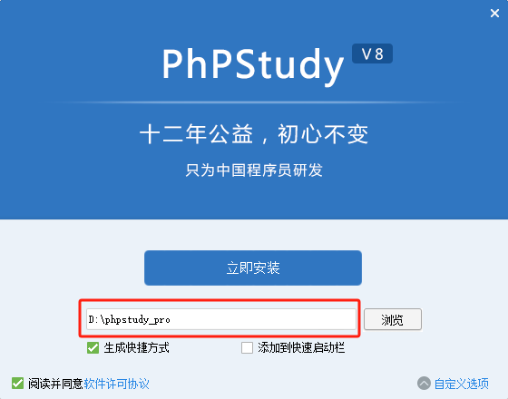

# PhpStudy让电脑秒变多站点Web服务器
> 一直使用 PhpStudy 作为本地 PHP 开发环境，PhpStudy 使配置服务器环境变得异常简单，彻底解放运维。确实和官网说的一样：“让天下没有难配的服务器环境”。

## 1 PhpStudy 简介
PhpStudy 是一套专门为服务器环境提供极佳配置的解决方案。具有强大的功能和诸多优点：
- 支持 Windows、MacOS、Linux 等操作系统
- 可一键创建网站、FTP、数据库、SSL
- 安全管理，计划任务，文件管理
- PHP多版本共存及切换
- 自带LNMP与LAMP

更多介绍请访问官网了解。官网地址：[https://www.xp.cn](https://www.xp.cn)。
## 2 下载 PhpStudy
1）访问官网：[https://www.xp.cn](https://www.xp.cn)，

图1  PhpStudy 下载入口

2）在首页点击第一个 Banner 里的 Windows 版

图2  立即下载

3）在弹出的页面中点击“立即下载”

图3  程序位数选择

4）根据自己计算机按照的 windwos 版本选择相应的版本，下载后是一个压缩包 phpStudy_64.zip，解压后的文件如下图：

图4  压缩包解压后的文件

## 3 安装 PhpStudy
1）点击执行文件安装
出现下面的安装界面

图5  自定义选项

2）自定义选项，主要选择安装目录，建议安装在C盘以外的盘里。并点击按钮“立即安装”

图6  自定义安装路径

3）执行安装。一路确认后，出现下面的界面，程序安装完成！

图7  安装完成

4）配置启动选项
点击上方图7红色方框内的红点，弹出下面的选项配置界面，我一般习惯选择 Apache，点击确认完成启动选项配置。

图8  配置启动选项

5）启动服务
点击下图的“启动”按钮，启动服务即可。

图9  启动服务

6）默认站点测试

图10  浏览器测试默认站点

7）查看默认站点根目录位置

图11  管理默认站点

图12  打开默认站点根目录

图13  默认站点根目录路径

后续在此站点根目录下进行编码就可以了。
## 4 PhpStudy 的基本应用
1）创建新的网站
虽然在默认根目录下可以进行编程开发，但不建议在此目录下进行，因为 PhpStudy 提供了多站点的服务功能，所以在实际开发中，会分别为每一个项目建立站点，每个站点都会有自己的根目录，便于开发和管理。下面将进行新站点的创建。

图14  创建一个新的网站
点击“创建网站”按钮，弹出下面的网站配置界面：

>

图15  设置站点域名并同步更新 hosts 文件

必须为新站点设置一个域名（该域名只是在本机测试使用，所以无需注册），注意要勾选“同步hosts”，这样在创建测试域名的同时，自动更新 hosts 文件，保证该域名能被正确地解析到本机。

2）在新站点根目录下添加 index.php 文件
通过网站管理菜单打开根目录

图16  打开根目录

新站点根目录内容如下：

图17  新站点根目录内容

新建一个 index.php 文件，内容如下：

图18  编辑 index.php 文件

3）浏览器测试访问新站点的 index.php 文件

图19  测试访问 index.php 文件

访问 index.php 成功！phpinfo() 命令成功返回当前 PHP 的相关配置。
# 5 为什么写这篇微博？
网上有很多介绍各种 PHP 服务器环境的文章，流行的产品有宝塔、PhpStudy，光PhpStudy的文字就层出不穷，泛滥不堪。由于后续我会继续尝试一些 PHP 应用的开发，写本博客的目的很简单，就是为了确保整个体系的整体性和连贯性，对后续的开发提供些许帮助。
后续我会重点学习基于 Lavarel/Lumen 的 restapi 的后台接口开发，希望感兴趣的朋友持续关注！谢谢大家的关注、点赞和收藏，但更期待大家拍砖，共同进步！
