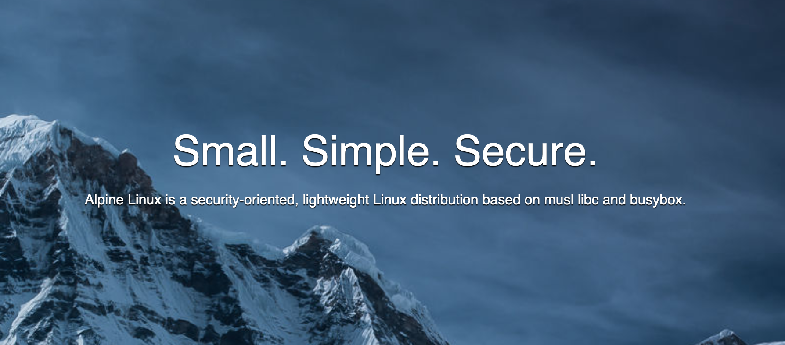
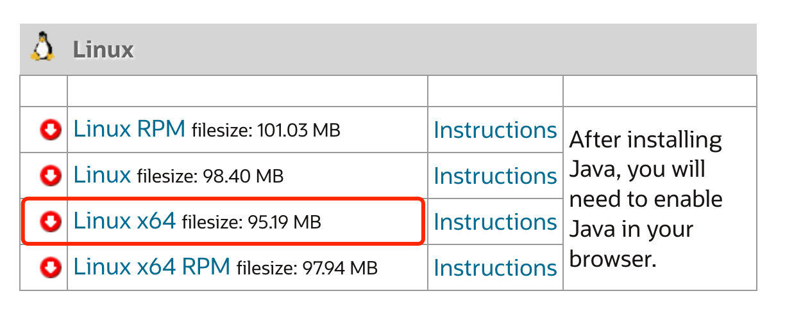
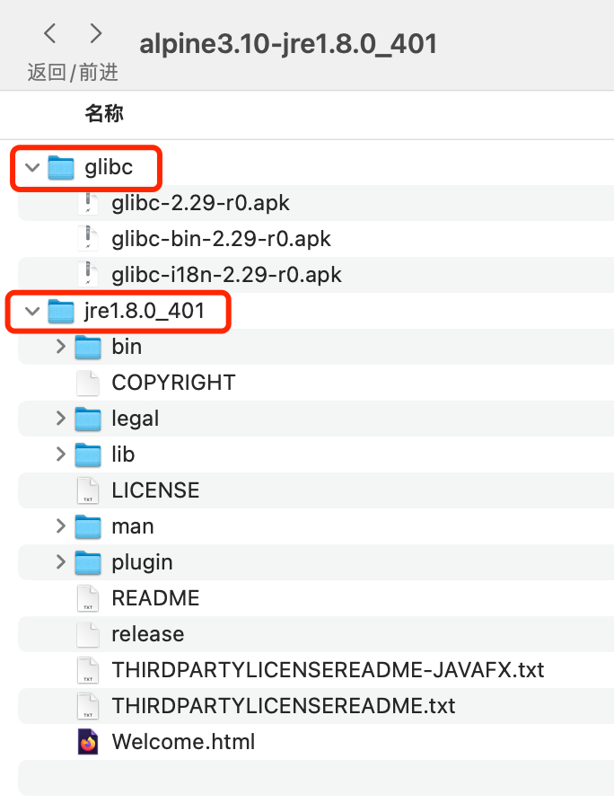
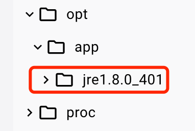
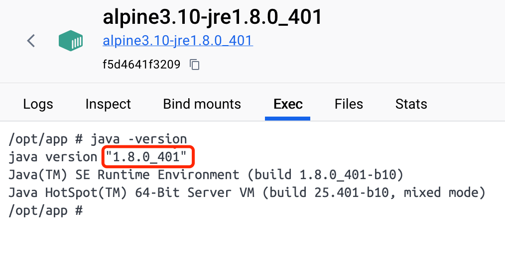

# 手搓Docker-Image-Creator（DIC）工具（03）：实现alpine+jre的镜像
>此篇博客将介绍如何使用 Docker 创建一个alpine3.10-jre1.8.0_401 的 Docker 镜像，并使用 Docker 运行起来。将用到 Dockerfile 的 COPY 命令、RUN 命令、ENV 命令，最终实现基于单一应用的 Dockerfile 构建镜像和运行。
## 1 关于 Alpine 镜像
alpine 是一个极简单的 Linux 系统，官网地址为：[https://alpinelinux.org](https://www.alpinelinux.org)。

<center>图1  Alpine Linux 官网 Banner</center>

从上图可以看到，Alpine Linux是一个基于musl-libc和busybox的面向安全的轻量级Linux发行版。主打的理念是：体积小、功能简洁、安全。后续我们的很多镜像都是基于 Alpine Linux。

下面将一步步来搭建单一应用的 Docker 镜像。
## 2 下载相关资源
将相关用到的资源下载下来，方便快速构建镜像。
### 2.1 创建应用目录
作为一个基于 apline3.10 和 jre1.8.0_401 的 Docker 镜像示例，我们就直接创建一个目录 alpine3.10-jre1.8.0_401 ，作为应用的根目录，用于存放单个应用的 Dockerfile 文件，以及用于编译生成镜像和验证的 shell 脚本文件。
### 2.2 下载 jre1.8.0_401 的运行包
包下载地址：[https://www.java.com/en/download/manual.jsp](https://www.java.com/en/download/manual.jsp)

<center>图2  jre1.8.0_401 下载入口</center>

下载的文件名为：jre-8u401-linux-x64.tar.gz，解压后的文件夹放到应用根目录 alpine3.10-jre1.8.0_401 中。

目录路径为：alpine3.10-jre1.8.0_401/jre1.8.0_401
### 2.3 下载 glibc 安装包
由于 alpine 是基于 musl-libc 的，所以需要将 glibc 安装到 alpine 中。包下载地址：

[glibc-2.29-r0.apk](https://github.com/sgerrand/alpine-pkg-glibc/releases/download/2.29-r0/glibc-2.29-r0.apk)

[glibc-bin-2.29-r0.apk](https://github.com/sgerrand/alpine-pkg-glibc/releases/download/2.29-r0/glibc-bin-2.29-r0.apk)

[glibc-i18n-2.29-r0.apk](https://github.com/sgerrand/alpine-pkg-glibc/releases/download/2.29-r0/glibc-i18n-2.29-r0.apk)

下载的三个文件都放到 alpine3.10-jre1.8.0_401/glibc 下，便于统一操作。

最终形成的资源包目录如下：


<center>图3  资源包目录位置</center>

## 3 编写 Dockerfile 文件
```Dockerfile
# Dockerfile
# 导入的镜像源
FROM alpine:3.10

# 作者 LABEL
LABEL maintainer="tanbushi@qq.com"

# 设置工作目录
WORKDIR /opt/app

# 更新源
RUN apk update && apk upgrade

# 拷贝 jre 到镜像中
COPY jre1.8.0_401 /opt/app/jre1.8.0_401/

# 拷贝 glibc 到镜像中
COPY glibc /opt/app/glibc/

# 安装glibc
RUN apk --no-cache add ca-certificates wget 
RUN wget -q -O /etc/apk/keys/sgerrand.rsa.pub https://alpine-pkgs.sgerrand.com/sgerrand.rsa.pub
RUN apk add /opt/app/glibc/glibc-2.29-r0.apk
RUN apk add /opt/app/glibc/glibc-bin-2.29-r0.apk
RUN apk add /opt/app/glibc/glibc-i18n-2.29-r0.apk

# 删除 缓存文件及 glibc
RUN rm -rf /var/cache/apk/* /opt/app/glibc

# 配置环境变量
ENV JAVA_HOME=/opt/app/jre1.8.0_401
ENV CLASSPATH=.:$JAVA_HOME/lib/dt.jar:$JAVA_HOME/lib/tools.jar
ENV PATH=$JAVA_HOME/bin:$PATH
```

## 4 编写并运行脚本 build.sh 和 run.sh
### 4.1 build.sh 

build.sh 用来编译生成 Docker 镜像的脚本，脚本内容如下：
```bash
#!/bin/bash

# 将当前应用根目录中的 Dockerfile 文件编译生成 Docker 镜像，镜像名为 alpine3.10-jre1.8.0_401
docker build -t alpine3.10-jre1.8.0_401 .（再提醒一下注意最后的点“.”）
```
通过 Docker 桌面版，可以看到 images 里面多了一个 alpine3.10-jre1.8.0_401 镜像。
### 4.2 run.sh

run.sh 用来运行 Docker 镜像的脚本，脚本内容如下：
```bash
#!/bin/bash
docker run -it --name alpine3.10-jre1.8.0_401 alpine3.10-jre1.8.0_401
```

通过 Docker 桌面版，可以看到 containers 里面多了一个 alpine3.10-jre1.8.0_401 容器，并且容器状态为 running。

### 4.3 验证镜像内容
Docker 桌面端打开容器 alpine3.10-jre1.8.0_401 ，进入容器。
- 检查文件夹

可以看到 jre1.8.0_401 文件夹，说明镜像已经成功拷贝了 jre1.8.0_401 文件夹，没有看到 glibc 文件夹，说明该文件夹已成功删除。


<center>图4  容器里的文件改动情况</center>

- 检查 java 命令

执行 java -version 命令，可以看到 java 版本为 1.8.0_401。

<center>图5  执行j ava 成功</center>

验证了基于 alpine3.10 和 jre1.8.0_401 的 Docker 镜像已经创建成功。

## 5 思考：
尽管上述示例已成功展示了如何借助 Dockerfile 创建满足基本需求的 Docker 镜像，但仍存在以下几个值得改进之处：

- **内容管理细化**：观察实例可知，镜像内部分内容（例如 `/opt/app/jre1.8.0_401` 等持久化运行环境）需永久保留，而另一部分如安装包（如 `/opt/app/glibc`）则在安装后即可移除。因此，区分并合理管理这两类不同性质的内容对于提升镜像管理效率至关重要。

- **构建与运行脚本标准化**：虽然建议采用 `build.sh` 和 `run.sh` 这样的统一脚本来构建和运行镜像，但在脚本中直接硬编码镜像名称和容器名称会降低脚本的通用性。为此，在处理多个镜像构建场景时，引入配置文件以分离此类变量，从而提高脚本复用率。

- **资源管理增强**：尽管目前主要依赖 Dockerfile 来进行镜像内容编排，然而面对大量镜像管理的需求时，发现资源文件的管理更为关键。有必要设计一种统一且灵活的资源管理机制，如通过配置文件、定制化脚本或命令行参数等方式来简化管理流程。

- **镜像版本控制及自动化**：当用户的资源库规模逐渐庞大、镜像数量激增时，镜像版本管理变得不可或缺。仅依靠 shell 脚本手动管理可能无法满足复杂项目的实际需求，此时应当探索通过组织镜像内容结构、动态生成 Dockerfile 等方法实现自动化管理，以适应更高级别的项目管理要求。

>请注意，本系列文章着重于个人日常学习的实践与记录，故在内容深度和广度上可能并不全面，但力求真实展现学习过程与实践经验。
>
>接下来的篇章中，我将着手按照已介绍的架构规范，逐步展示如何构建一个用于多个应用共享资源的 Docker 镜像库。这一系列操作实操性极强，请保持关注，敬请期待！
