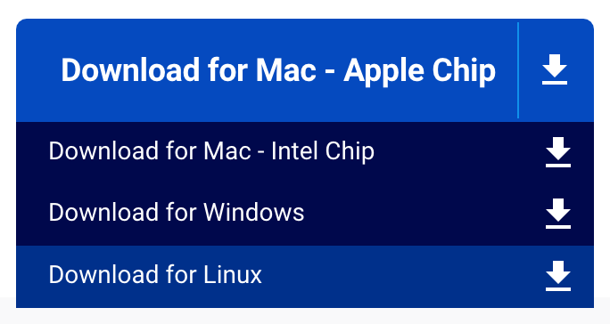
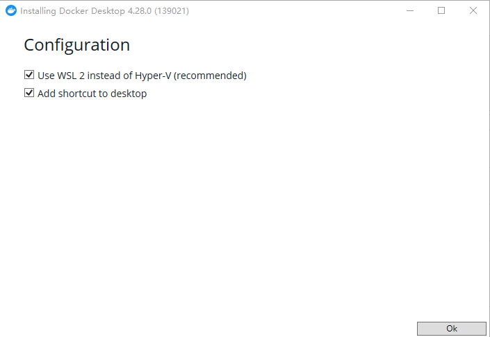
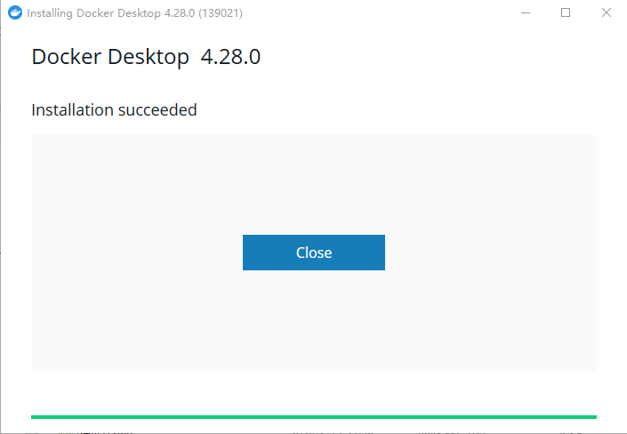
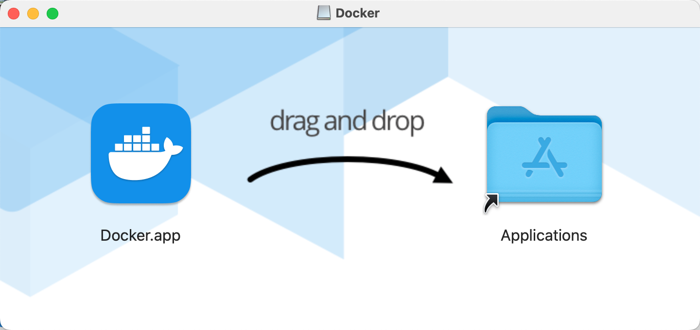
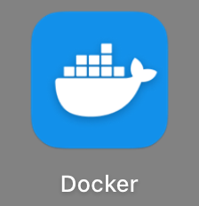
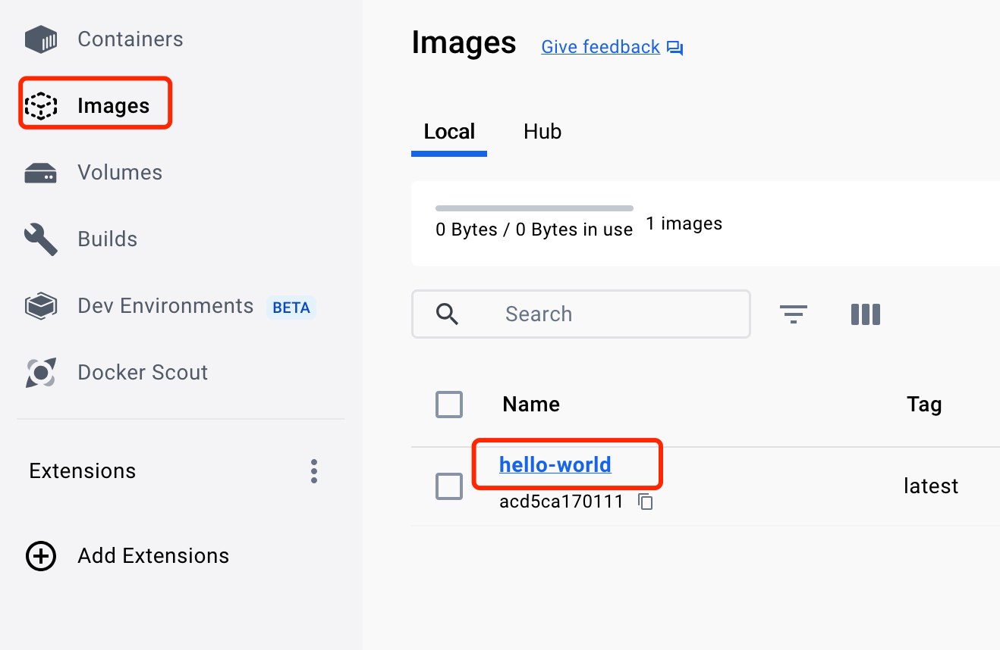
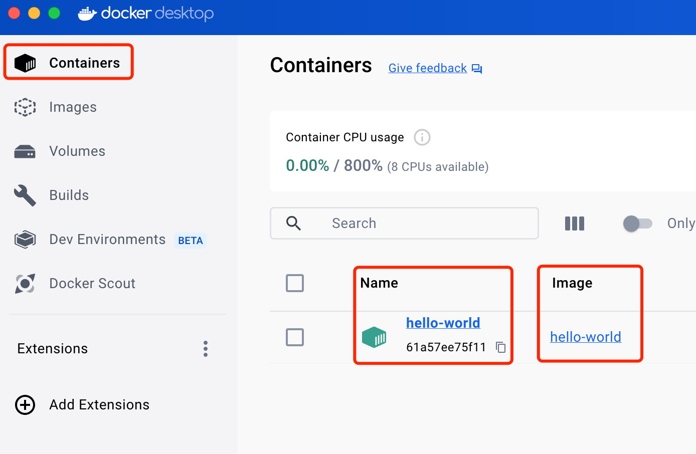
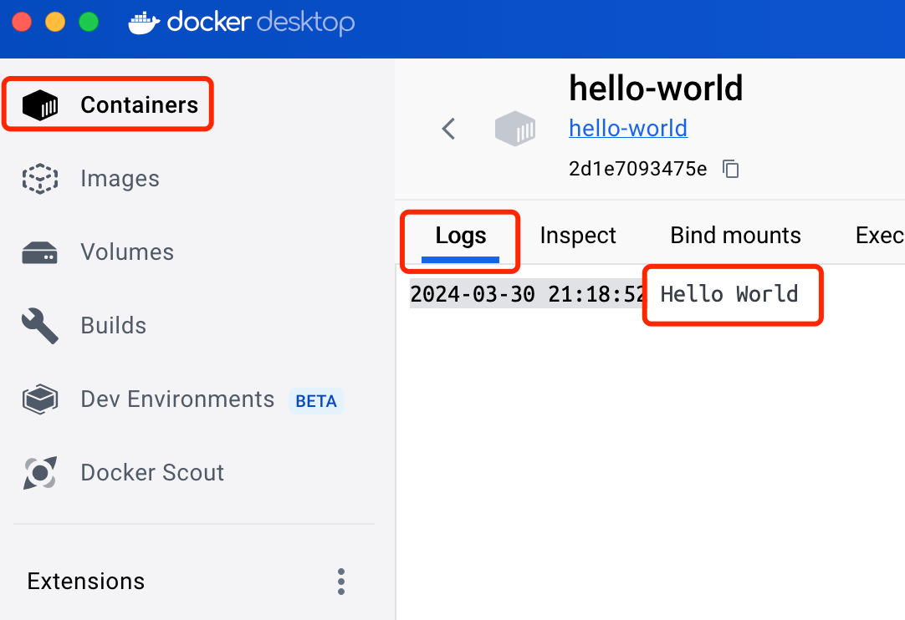

# 手搓 Docker Image Creator（DIC）工具（02）：预备知识

> 此节主要简单介绍一下 Docker、Dockerfile 的基本概念，Dockerfile 对的基本语法，Windows 和 macOS 下 Docker 桌面的安装，Docker 镜像的创建和运行测试等。

## 1 关于 Docker

Docker 是一个开源的应用容器引擎，它允许开发者打包应用及依赖包到一个可移植的容器中，然后发布到任何流行的 Linux 机器或 Windows 机器上，也可以实现虚拟化。

关于 Docker 的更详细信息、以及Docker 在 CentOS 里的安装，在我的另一篇博文里做了很详细的介绍，在此就不在赘述。有需要了解的请参考此篇《[Docker搭建LNMP环境实战（05）：CentOS环境安装Docker-CE](https://blog.csdn.net/weixin_42398461/article/details/137051477)》。


## 2 关于 Dockerfile

Dockerfile 是一个文本文件，用于定义 Docker 镜像的构建过程，通过一组指令（instructions）来指导 Docker 如何自动构建一个特定的镜像。以下是 Dockerfile 的关键命令或特性：

- 基础镜像（FROM）
  
Dockerfile 通常从指定的基础镜像开始构建，例如 `FROM ubuntu:latest` 表示基于最新版 Ubuntu 镜像。

- 维护者信息（MAINTAINER）
  
指定镜像的维护者信息，但已被官方弃用，推荐使用 LABEL 指令设置元数据。

- 工作目录（WORKDIR）
  
设置镜像内部的工作目录，后续的 RUN、CMD、ENTRYPOINT 等命令将在该目录下执行。

- 复制文件（COPY）
  
将本地文件或目录复制到镜像内部的指定路径。

- 添加文件（ADD）
  
类似 COPY，但 ADD 还支持从 URL 下载文件并解压缩（如果文件是压缩格式）。

- 运行命令（RUN）
  
执行任意 shell 命令或者脚本，用于安装软件包、修改配置等操作，每次 RUN 会创建一个新的镜像层。

- 环境变量（ENV）
  
设置环境变量，可在构建时和运行时使用。

- 暴露端口（EXPOSE）
  
指定镜像运行时将要监听的网络端口，但不映射到宿主机，实际端口映射需在运行容器时指定。

- 设置容器启动命令（CMD）
  
指定容器启动后的默认执行命令和参数，可以被 docker run 命令后面跟的命令覆盖。

- 入口点（ENTRYPOINT）
  
类似 CMD，但具有更高的优先级且不可被 docker run 命令覆盖，通常用于指定一个一直存在的长期运行的进程。

通过编写 Dockerfile 并执行 `docker build -t <image-name> .` 命令，可以从源代码和依赖项自动构建一个完整的、可重复使用的 Docker 镜像。这个镜像可以上传到 Docker Registry 分享给他人，或者在其他环境中拉取下来直接运行。

## 3 Docker 集成环境安装

- Docker 官网   https://www.docker.com
- Docker Desktop https://www.docker.com/products/docker-desktop/

### 3.1 Docker 桌面版介绍
Docker Desktop 是一款面向开发者的桌面应用程序，它允许用户在本地机器（Windows、Mac OS）上运行 Docker 容器和管理 Docker 环境。

**主要特性：**

- 提供图形用户界面，方便管理和监控 Docker 容器及镜像。
- 支持快速启动和配置 Docker 开发环境。
- 内置 Kubernetes 支持，可以在本地进行 Kubernetes 应用的部署和测试。
- 集成 Docker CLI 工具，支持通过命令行操作 Docker。

### 3.2 Docker 桌面版应用场景
- 在开发阶段，Docker Desktop 可用于创建隔离的开发环境，确保开发人员的环境一致性。
- 对于微服务架构的应用，开发人员可以在本地模拟多服务运行环境，便于调试和集成测试。
- 教育培训场景下，教师可以利用 Docker Desktop 快速搭建教学环境，学生则可以在自己电脑上复现课程中的实验环境。

### 3.3 Docker 桌面版下载、安装与使用
用户可以下载并安装 Docker Desktop 到个人电脑上，安装过程中会自动配置所需的虚拟机、网络设置等环境。
安装完成后，用户可以通过 Docker Desktop 启动 Docker 服务，并通过 Docker CLI 或图形界面拉取、创建、运行容器。

#### 3.3.1 Docker 桌面版下载
Docker 桌面版下载入口：

<center>图1  Docker 桌面版下载链接</center>

**1）Windows 版下载**

[Windows 安装 exe 文件](https://desktop.docker.com/win/main/amd64/Docker%20Desktop%20Installer.exe)

**2）Mac OS 版下载**

[Mac OS 安装 dmg 文件 - Apple 芯片](https://desktop.docker.com/mac/main/arm64/Docker.dmg)

[Mac OS 安装 dmg 文件 - Intel 芯片](https://desktop.docker.com/mac/main/amd64/Docker.dmg)

#### 3.3.2 Docker 桌面版安装

**1）Windows 版安装**

点击 “Docker Desktop Installer.exe”文件，开始安装。

<center>图2  选择默认配置即可</center>


<center>图3  安装完成</center>

**2）macOS 版安装**

macOS 桌面版本的按照其实非常简单，双击执行 docker.dmg 文件，弹出下面的窗口，将图标拖到 Applications 下即可。

<center>图4  macOS 桌面版安装</center>

## 4 小试 Dockerfile 编译及测试
在本博客的第2部分“2 关于 Dockerfile”里，我们介绍了 Dockerfile 的基本语法，以及创建 Docker 镜像所要用到的 build 命令。下面我们通过一个简单的示例来演示 Dockerfile 的使用。
首先，点击 Docker 图标，进入 Docker 桌面版。

<center>图5  点击 Docker 图标，进入桌面版</center>

`备注：Windows 桌面版和 macOS 桌面版的操作基本一样，下面以 macOS 桌面版为例演示`
### 4.1 创建一个简单的 Dockerfile
```Dockerfile
# 此 Dockerfile 以引用官方的轻量级基础镜像作为示例

# 使用官方的轻量级基础镜像
FROM busybox
 
# 当容器启动时运行 echo 命令
CMD ["echo", "Hello World"]
```
此 Dockerfile 的功能很简单，在文件的注释里描述得很清楚。
### 4.2 编译生成和查看镜像
**1）编译生成镜像**

将 Dockerfile 文件保存到本地（注意文件名为 Dockerfile ），并以命令行进入到该目录。
执行 `docker build -t hello-world .`（注意最后有个“点”）命令，即可编译出名为 hello-world 的 Docker 镜像。

**2）查看镜像**

进入 Docker 桌面版，
点击 Images 菜单，即可看到 hello-world 镜像。

<center>图6  查看 hello-world 镜像</center>

### 4.3 运行镜像并查看容器
**1）运行镜像，生成容器**

执行 `docker run -itd --name hello-world hello-world` 命令，即可生成名为 hello-world 的容器。

**2）查看容器**

进入 Docker 桌面版，点击 Containers 菜单，即可看到 hello-world 容器。


<center>图7  查看 hello-world 容器</center>

点击logs，可以看到容器输出的日志信息：Hello World，说明 Dockerfile 的 CMD 命令执行成功。


<center>图8  查看 CMD 命令输出的 Hello World 信息</center>

### 4.4 删除镜像和容器

**1）删除容器**

执行 `docker rm -f hello-world` 命令，即可删除 hello-world 容器。
>-f 表示强制删除容器，即使是运行状态下的容器也可以删除

**2）删除镜像**

执行 `docker rmi hello-world` 命令，即可删除 hello-world 镜像。
>只有在删除该镜像的容器之后，才能删除镜像。