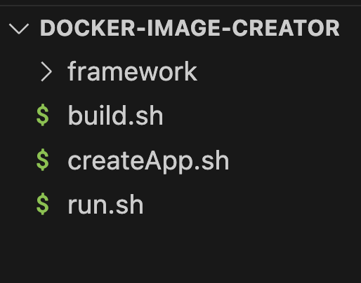
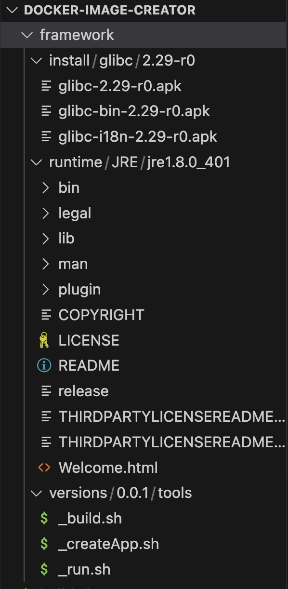
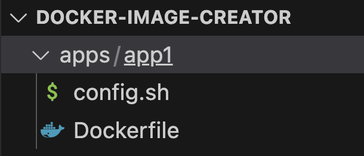
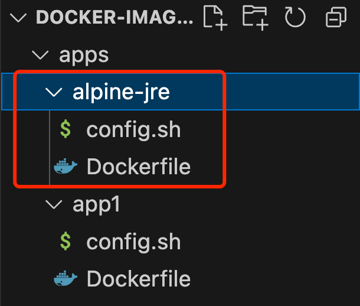

# 手搓Docker-Image-Creator（DIC）工具（04）：DIC的代码实现
>此系列的前 3 篇主要是介绍了 Docker 的应用、Docker 编排文件 Dockerfile 的常用命令、以及 Docker 镜像的构建过程等都进行简单介绍。尤其在第 3 篇，讲述了 Docker 运行时、安装用等资源，并在文末提出了存在的不足和改进的方向，本篇就直接从代码开始介绍如何使用 DIC 工具来创建 Docker 镜像。

## 1 了解框架目录结构
### 1.1 框架根目录 docker-image-creator（目录可以随意取）

<center>图1  简洁的第一层目录结构</center>

第一级很简洁，只有 3 个文件和 1 个文件夹，分别是：
- framework 文件夹，是整个工具的基础，用于存放 DIC 工具的资源和工具脚本
- createApp.sh 文件，根据相关参数信息创建一个应用项目
- build.sh 文件，根据 Dockerfile 文件的设定，对应用项目进行构建，最终生成 Docker 镜像
- run.sh 文件，将制定的镜像在 Docker 里以容器的形式运行

### 1.2 framework 目录结构
既然 framework 是基础，那就重点看看此目录下的内容，如下图：


<center>图2  framework 子目录构成</center>

framework 目录下包含了三个目录，分别是：
- install - 用来存放最终拷入到镜像里的安装包（安装结束后，最好从镜像里删除）
- runtime - 用来存放最终考入到镜像里的运行时文件，不能从镜像里删除
- versions - 用来存放不同版本的安装安装工具包，就是脚本文件，实现多版本的支持。这个版本号需要在创建项目时选择好，并记录在应用的配置文件 config.sh 文件里

下图展示 framework 的目录结构全貌：


<center>图3  framework 的目录结构全貌</center>

在此实例中：
- install目录下有 1 个安装包 glibc，并区分版本目录，便于存取
- runtime目录下有 1 个运行时文件，并区分版本目录，便于存取
- versions目录下有 1 个安装工具包，并区分版本目录，便于选择不同版本的管理脚本

## 2 创建应用项目
使用该框架的第一步就是要创建一个应用项目，由 createApp.sh 文件来完成，该文件会根据输入的参数信息创建一个应用项目。
### 2.1 createApp.sh 文件
目前的脚本并不复杂，所以没有使用函数，直接将脚本内容写在 createApp.sh 文件里。

```bash
#!/bin/bash

# 用法：./createApp.sh [creatorVersion] [appName] [appVersion]
# 参数
# creatorVersion=$1 - 生成器版本号
# appName=$2 - 应用名称
# appVersion=$3 - 应用版本号

set -e # 遇到错误时退出脚本

# 生成器版本号
creatorVersion=$1
if [ -z "$creatorVersion" ]; then
  echo "请输入生成器版本号"
  exit 1
fi

# 应用名称
appName=$2
if [ -z "$appName" ]; then
  echo "请输入应用名称"
  exit 2
fi

# 应用版本号
appVersion=$3
if [ -z "$appVersion" ]; then
  echo "请输入应用版本号"
  exit 3
fi

# 检查版本号在 framework 目录下是否存在
if [ ! -d "framework/versions/$creatorVersion" ]; then
  echo "生成器版本 $creatorVersion 不存在！创建应用失败！！"
  exit 4
fi

# 调用指定版本下的 _createApp.sh 脚本，需要根据 _createApp.sh 脚本要求传参
. ./framework/versions/$creatorVersion/tools/_createApp.sh $1 $2 $3
```
从createApp.sh脚本的内容分析，其核心作用在于接收并验证用户传递的参数，然后根据指定的版本信息调用位于 framework/versions/ 目录下对应版本的 _createApp.sh 子脚本来执行实际的项目创建操作。换言之，createApp.sh扮演了引导和参数预处理的角色，而具体的项目构建逻辑实现在各个版本的 _createApp.sh 中。

同样的模式也体现在其他相关脚本中，如build.sh和run.sh。build.sh脚本负责调用对应的 _build.sh 子脚本进行构建任务，而run.sh脚本则是通过调用 _run.sh 子脚本来执行项目的运行操作。这些主脚本与子脚本之间的关系构成了一个模块化的执行结构，每个主脚本作为对外接口统一处理输入和调度，而具体功能的实现则分散在各版本的子脚本中。

这样设计的好处是，可以充分发挥各个版本的功能模块化，每个版本都可以独立扩展和修改，而不会影响其他版本。

### 2.2 _createApp.sh 文件
_createApp.sh 文件的代码如下：

```bash
#!/bin/bash

# 用法：./_createApp.sh [creatorVersion] [appName] [appVersion]

set -e # 遇到错误时退出脚本

# 创建应用目录
mkdir -p apps/$appName # 创建应用目录

# 如果 Dockfile 文件不存在，则创建一个模版
if [ ! -f "apps/$appName/Dockerfile" ]; then
  echo "FROM busybox:latest" > apps/$appName/Dockerfile
fi

# 生成配置文件
echo "#!/bin/bash" > apps/$appName/config.sh
echo "appName=$appName # 应用名称" >> apps/$appName/config.sh
echo "appVersion=$appVersion # 应用版本号" >> apps/$appName/config.sh
echo "imageName=$appName # 镜像名称" >> apps/$appName/config.sh
echo "containerName=$appName # 容器名称" >> apps/$appName/config.sh
echo "creatorVersion=$creatorVersion # 生成器版本号" >> apps/$appName/config.sh

# 修改 config.sh 的可执行权限
chmod 755 apps/$appName/config.sh

echo ""
echo "*********************************************************"
echo "项目【 $appName 】创建成功！"
echo "*********************************************************"
echo ""
```
_createApp.sh脚本的主要执行流程如下：

- 初始化应用目录：它会创建一个新的应用目录
- 生成 Dockerfile 模版：如果在应用根目录下未找到 Dockerfile 文件，则自动生成一个标准的 Dockerfile 模版
- 配置信息写入 config.sh：在应用根目录下创建并填充 config.sh 文件，其中包含了诸如应用名称、版本号、镜像名称、容器名称以及生成器版本号等关键信息，同时赋予该文件可执行权限

至此，项目的基本结构已经创建完毕。

## 3 创建实例程序
运行 macOS 的终端，或者 Windows 里的 Git Bash 程序（下同）。

### 3.1 进入 createApp.sh 文件所在的目录，运行：

```bash
./createApp.sh 0.0.1 app1 1.0.0
```
- 0.0.1 为生成器版本号，由于比较“低调”就取了个“小号”，但需要在 `framework/versions/` 下能找到这个版本号才可以运行
- app1 为应用名称
- 1.0.0 为应用版本号

运行并成功创建应用项目后，目录结构改变如下图：


<center>图4  创建后的应用项目目录结构</center>

从上图可以看到，创建了一个 apps 目录，改目录是所有应用的根目录，目前包含了刚创建的项目目录 app1 ，该目录下包含了 config.sh、Dockerfile 两个文件。

### 3.2 config.sh 文件

```bash
#!/bin/bash

appName=app1 # 应用名称
appVersion=1.0.0 # 应用版本号
imageName=app1 # 镜像名称
containerName=app1 # 容器名称
creatorVersion=0.0.1 # 生成器版本号
```

### 3.3 Dockerfile 文件（默认模板）

```dockerfile
FROM busybox:latest
```
就一句话！可以理解为 Dockerfile 生成镜像时创建的 “Hello World”。

```bash
#!/bin/bash

set -e # 遇到错误时退出脚本

# 判断是否运行过配置文件 config.sh，如果未运行过，则运行配置文件
if [ -z "$configured" ]; then
  . ./config.sh
  configured=true # 设置一个标志，表示已经运行过配置文件
fi

# 检查 Docker 是否在运行
if ! docker info > /dev/null 2>&1; then
  echo "Docker 没有运行。请启动 Docker 再试！"
  exit 1
fi

# 查看指定名称和TAG的镜像是否存在
set +e
rslt=`docker images | grep -E "^$appName\s+$appVersion\s+"`
set -e
# 判断字符串是否为空
if [ -z "$rslt" ]; then
  echo "镜像不存在，请先构建镜像！"
  exit 2
fi

# 检查容器是否存在
if docker ps -a --filter "name=$containerName" | grep -q "$containerName"; then
  echo "容器存在，先停止，再删除..."
  # 容器存在，先停止，再删除
  docker stop $containerName > /dev/null 2>&1
  docker rm $containerName > /dev/null 2>&1
fi

docker run -itd --name $containerName $imageName:$appVersion
echo ""
echo "*********************************************************"
echo "成功创建容器：【 $containerName 】！"
echo "*********************************************************"
echo ""
```

上面的代码注释很详细，而且脚本功能也不复杂，就不多说了。


## 4 编译和运行脚本介绍
### 4.1 build.sh
```bash
#!/bin/bash

# 用法：./build.sh [appName]

# 参数
# appName=$1 - 应用名称

set -e # 遇到错误时退出脚本

# 判断是否带有参数 $1
appName=$1
if [ -z "$appName" ]; then
  echo "请输入应用名称"
  exit 1
fi

# 根据 appName 查找应用目录 appPath
appPath="apps/$appName"
echo $appPath
if [ ! -d "$appPath" ]; then
  echo "应用 $appName 不存在！"
  exit 2
fi

# 判断是否运行过配置文件 config.sh，如果未运行过，则运行配置文件
if [ -z "$configured" ]; then
  # 检查 config.sh 文件是否存在
  if [ ! -f "$appPath/config.sh" ]; then
    echo "配置文件 $appPath/config.sh 不存在！请创新创建项目或创建 config.sh 配置文件！"
    exit 3
  fi
  . $appPath/config.sh
  configured=true # 设置一个标志，表示已经运行过配置文件
fi

toolsPath=./framework/versions/$creatorVersion/tools
. $toolsPath/_build.sh # 调用 framwork 下对应版本的 _build.sh 脚本
```
### 4.2 _build.sh
```bash
#!/bin/bash

set -e # 遇到错误时退出脚本

# 判断是否运行过配置文件 config.sh，如果未运行过，则运行配置文件
if [ -z "$configured" ]; then
  . ./config.sh
  configured=true # 设置一个标志，表示已经运行过配置文件
fi

# 检查 Docker 是否在运行
if ! docker info > /dev/null 2>&1; then
  echo "Docker 没用运行。请启动 Docker 再试！"
  exit 1
fi

# 判断 Dockerfile 文件是否存在
if [ ! -f "$appPath/Dockerfile" ]; then
  echo "Dockerfile 文件不存在。请检查！"
  exit 2
fi

# 构建镜像，注意此处用到了
docker build -f $appPath/Dockerfile -t $imageName:$appVersion .
echo ""
echo "*********************************************************"
echo "成功生成 Docker 镜像：【 $imageName:$appVersion 】！"
echo "*********************************************************"
echo ""
```
### 4.3 run.sh
```bash
#!/bin/bash

# 用法：./run.sh [appName]
# 参数
# appName=$1 - 应用名称

set -e # 遇到错误时退出脚本

# 根据 appName 查找应用目录
appName=$1
if [ -z "$appName" ]; then
  echo "请输入应用名称"
  exit 1
fi
appPath="apps/$appName"
echo $appPath
if [ ! -d "$appPath" ]; then
  echo "应用 $appName 不存在！"
  exit 2
fi

# 判断是否运行过配置文件 config.sh，如果未运行过，则运行配置文件
if [ -z "$configured" ]; then
  . $appPath/config.sh
  configured=true # 设置一个标志，表示已经运行过配置文件
fi

echo $creatorVersion
toolsPath=./framework/versions/$creatorVersion/tools
echo $toolsPath

. $toolsPath/_run.sh
```
### 4.4 _run.sh
```bash
#!/bin/bash

set -e # 遇到错误时退出脚本

# 判断是否运行过配置文件 config.sh，如果未运行过，则运行配置文件
if [ -z "$configured" ]; then
  . ./config.sh
  configured=true # 设置一个标志，表示已经运行过配置文件
fi

# 检查 Docker 是否在运行
if ! docker info > /dev/null 2>&1; then
  echo "Docker 没有运行。请启动 Docker 再试！"
  exit 1
fi

# 查看指定名称和TAG的镜像是否存在
set +e
rslt=`docker images | grep -E "^$appName\s+$appVersion\s+"`
set -e
# 判断字符串是否为空
if [ -z "$rslt" ]; then
  echo "镜像不存在，请先构建镜像！"
  exit 2
fi

# 检查容器是否存在
if docker ps -a --filter "name=$containerName" | grep -q "$containerName"; then
  echo "容器存在，先停止，再删除..."
  # 容器存在，先停止，再删除
  docker stop $containerName > /dev/null 2>&1
  docker rm $containerName > /dev/null 2>&1
fi

docker run -itd --name $containerName $imageName:$appVersion
echo ""
echo "*********************************************************"
echo "成功创建容器：【 $containerName 】！"
echo "*********************************************************"
echo ""
```
## 5 运行实例程序
运行 macOS 的终端，或者 Windows 里的 Git Bash 程序，进入 DIC 框架根目录，运行 build.sh 脚本。
### 5.1 编译镜像
运行：
```bash
./build.sh
```
运行成功后，输入镜像查看命令：
```bash
docker images
```
会看到列举出 app1 镜像。
### 5.2 运行容器
运行：
```bash
./run.sh
```
运行成功后，输入容器查看命令：
```bash
docker ps -a
```
会看到列举出 app1 容器。
创建单个最简应用的测试就完成了。接下来我们来实现一个 alpine+jre 镜像。

## 6 再一次实现 alpine+jre 镜像
### 6.1 创建一个新的应用

终端进入 DCI 工具所在的目录，运行：
```bash
./createApp.sh 0.0.1 alpine-jre 1.0.0
```
轻松创建应用项目：alpine-jre，如下图：


<center>图5  alpine-jre 镜像应用目录</center>

### 6.2 修改 Dockerfile 文件

内容如下：
```dockerfile
FROM busybox:latest
# Dockerfile
# 导入的镜像源
FROM alpine:3.10

# 作者 LABEL
LABEL maintainer="tanbushi@qq.com"

# 设置工作目录
WORKDIR /opt/app

# 更新源
RUN apk update && apk upgrade

# 拷贝 jre 到镜像中
COPY framework/runtime/JRE/jre1.8.0_401 /opt/app/runtime/JRE/jre1.8.0_401/

# 拷贝 glibc 到镜像中
COPY framework/install/glibc/2.29-r0 /opt/app/install/glibc/2.29-r0/

# 安装glibc
RUN apk --no-cache add ca-certificates wget 
RUN wget -q -O /etc/apk/keys/sgerrand.rsa.pub https://alpine-pkgs.sgerrand.com/sgerrand.rsa.pub
RUN apk add /opt/app/install/glibc/2.29-r0/glibc-2.29-r0.apk
RUN apk add /opt/app/install/glibc/2.29-r0/glibc-bin-2.29-r0.apk
RUN apk add /opt/app/install/glibc/2.29-r0/glibc-i18n-2.29-r0.apk

# 删除缓存文件及 install 目录
RUN rm -rf /var/cache/apk/* /opt/app/install

# 配置环境变量
ENV JAVA_HOME=/opt/app/runtime/JRE/jre1.8.0_401
ENV CLASSPATH=.:$JAVA_HOME/lib/dt.jar:$JAVA_HOME/lib/tools.jar
ENV PATH=$JAVA_HOME/bin:$PATH
```

## 6.3 创建和镜像和运行容器

终端进入 DIC 框架根目录，运行：
```bash
./build.sh alpine-jre 
```
成功创建镜像：alpine-jre:1.0.0

继续运行：
```bash
./run.sh alpine-jre
```
成功创建容器：alpine-jre

使用 docker exec 命令直接进入容器测试：
```bash
docker exec -it alpine-jre /bin/sh
```
出现下面的显示即表示已进入容器内部：
```bash
/opt/app #
```
在此窗口输入 java 命令：
```bash
java -version 
```
可以看到 JRE 版本：
```bash
java version "1.8.0_401"
Java(TM) SE Runtime Environment (build 1.8.0_401-b10)
Java HotSpot(TM) 64-Bit Server VM (build 25.401-b10, mixed mode)
```
alpine-jre 镜像生成和测试成功。退出容器：
```bash
exit
```

## 7 总结
在此阶段，我们成功完成了DIC（Docker Image Creation）工具的开发与初步测试工作，证明了其能够有效地用于生成各类定制化镜像。用户可以根据需求灵活运用这一工具来构建其他所需的Docker镜像。

为进一步提升DIC工具的用户体验和功能性，我们可以考虑以下优化方向：

- 图形用户界面集成：引入GUI界面，方便用户通过直观的操作选择所需资源文件，简化繁琐的命令行操作步骤。例如，用户可以直接在界面上拖拽或选择要打包进镜像的文件和目录，降低使用门槛。

- 增强复杂操作支持：扩展DIC工具的能力，使其能够处理更为复杂的场景，如添加多阶段构建、自动依赖检测与安装、环境变量配置等功能。通过智能分析和自动化处理，减少人工编写Dockerfile时的工作量和出错率。

- 自动化Dockerfile生成：基于用户在界面上的选择和配置，DIC工具能够自动生成规范且高效的Dockerfile，不仅提升了工作效率，还确保了Dockerfile的质量和一致性。

- 总之，尽管目前DIC工具已达到基本可用状态，但仍存在许多潜在的改进空间。我们鼓励开发者们根据实际应用场景不断对其进行迭代升级，共同推动DIC工具向着更加便捷、强大的方向发展。期待未来能见证一个功能全面且易用性出色的DIC工具诞生！