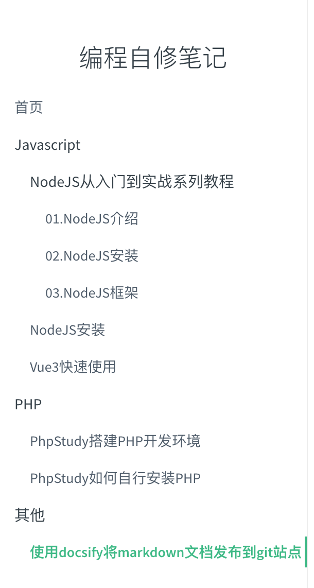

# 使用docsify将markdown文档发布到git站点
> 使用 markdown 记录编程笔记，建立自己的知识库，并通过githubPages实现在线分享。

## 1 项目目标
计划创建一个笔记的项目，此项目的说明文档都采用 markdown 文件格式，markdown 编辑工具采用 marktest 软件，项目文件保存到 github 里，并通过 docsify 工具，实现在 github 里在线浏览展示。

## 2 项目目录结构（示例）
示例用的笔记文件目录结构如下：
```
CodingNotes // 此项目的根目录  └
    │—— Javascript // Javascript专题笔记存放目录
    │    │—— NodeJS从入门到实战系列教程
    │    │    │—— 01.NodeJS介绍.md
    │    │    │—— 02.NodeJS安装.md
    │    │    └—— 03.NodeJS框架.md
    │    │—— NodeJS安装.md
    │    └—— Vue3快速使用.md
    │—— PHP // PHP专题笔记存放目录
    │    │—— PhpStudy搭建PHP开发环境.md
    │    └—— PhpStudy如何自行安装PHP.md
    │—— 其他 // 其他专题笔记存放目录
    │    └—— 使用docsify将markdown文档发布到git站点.md 
    └—— static // 笔记里用到的静态资源，如图片等的存储目录
```

## 3 安装调试 docsify

### 3.1 官网：[https://docsify.js.org](https://docsify.js.org/)

### 3.2 doscify 是什么？
Docsify 即时生成您的文档网站。与 GitBook 不同，它不会生成静态 html 文件。相反，它会智能地加载和解析您的 Markdown 文件并将其显示为网站。要开始使用它，您所需要做的就是创建一个index.html并将其部署到 GitHub Pages 上。

### 3.3 安装 docsify
建议docsify-cli全局安装，有助于本地初始化和预览网站。
下面的命令在终端或命令行里运行
```bash
npm i docsify-cli -g
```

### 3.4 初始化 docsify
使用 `docsify init [目录]`命令，目录可选，如果是当前目录作为初始化的目标目录，可空。
```bash
docsify init
```
如果出现：Are you sure you want to rewrite it? (y/N)，请输入”y“即可。
到此初始化完毕，将当前目录当成文档根目录，并生成 .nojekyll、index.html、README.md 三个文件。

### 3.5 开始写文档
编辑 README.md
```markdown
# 编程自修笔记

> 编程自修过程记录

## 记录自己编程学习笔记，便于自己查询，也希望能对您提供一点帮助！
```

### 3.6 预览网站
同样，使用 `docsify serve [目录]`命令，目录可选，如果预览当前目录，目录参数可空。
```bash
docsify serve
```
浏览器访问：http://localhost:3000，即可实现 markdown 文档的浏览了。

### 3.7 配置侧边栏
首先，配置 loadSidebar，如下，配置 loadSidebar 为 true。
```html
<script>
  window.$docsify = {
    loadSidebar: true
  }
</script>
```
接着创建 _sidebar.md 文件，内容如下
```markdown
* [首页](/)
* Javascript
    * NodeJS从入门到实战系列教程
        * [01.NodeJS介绍](/Javascript/NodeJS从入门到实战系列教程/01.NodeJS介绍)
        * [02.NodeJS安装](/Javascript/NodeJS从入门到实战系列教程/02.NodeJS安装)
        * [03.NodeJS框架](/Javascript/NodeJS从入门到实战系列教程/03.NodeJS框架)
    * [NodeJS安装](/Javascript/NodeJS安装)
    * [Vue3快速使用](/Javascript/Vue3快速使用)
* PHP
    * [PhpStudy搭建PHP开发环境](/PHP/PhpStudy搭建PHP开发环境)
    * [PhpStudy如何自行安装PHP](/PHP/PhpStudy如何自行安装PHP)
* 其他
    * [使用docsify将markdown文档发布到git站点](/其他/使用docsify将markdown文档发布到git站点)
```
需要在根目录创建 .nojekyll 命名的空文件，阻止 GitHub Pages 忽略命名是下划线开头的文件。
在浏览器里访问 [http://localhost:3000](http://localhost:3000)，得到侧边栏结果如图：



### 3.8 显示目录
自定义侧边栏同时也可以开启目录功能。设置 index.html 中的 subMaxLevel 配置项。
```html
<script>
  window.$docsify = {
    loadSidebar: true,
    subMaxLevel: 3
  }
</script>
```

## 4 部署到 Github Pages
Github Pages 官网入口：[https://pages.github.com/](https://pages.github.com/)

在 github 创建一个仓库，仓库名为：tanbushi.github.io

按默认设置创建仓库

打开仓库 -> Settings，找到偏底部的 github pages

选择一个主题：Choose a Theme


注意，如何让生成的页面图片居中，修改 idnex.html 文件，

1）在 body 标签中添加 class="docsify-content"
<body class="docsify-content">

2）添加如下样式：
<style>
  .docsify-content img {
  display: block;
  margin-left: auto;
  margin-right: auto;
}
</style>

