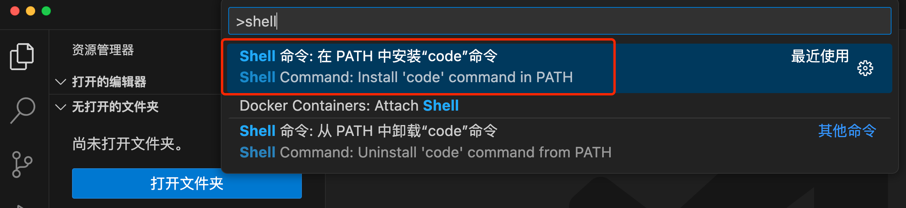
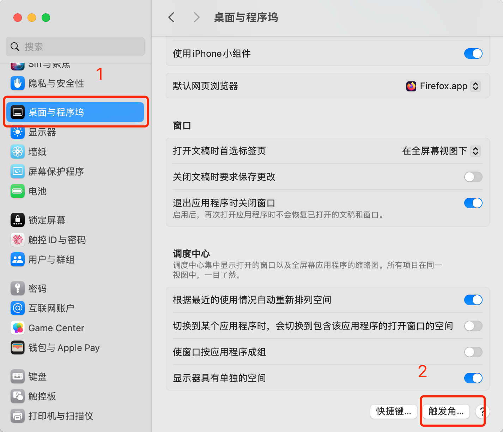
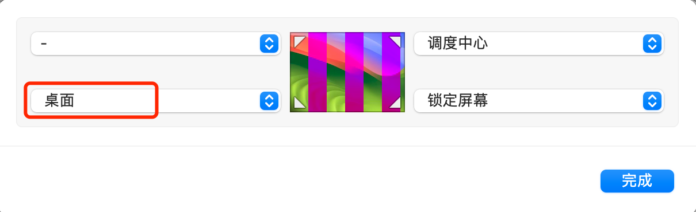

# 小贴士-分享macOS中几个“隐藏”的快捷功能
> 在使用 macOS 操作系统时，通过日常学习和积累，了解到一些在 macOS 下比较隐藏但非常实用的快捷功能，确实带来了很多便利，只要常练习、常使用，一定能大大提升工作效率。
## 1 命令行打开 vscode
在 windows 下，在 cmd 命令行窗口里输入：
```bash
code .
```
就能快速打开 vscode，且默认打开当前文件夹。但在macOS的终端窗口里，此命令默认是不生效的，需要配置。

打开vsocode，使用快捷键⇧⌘P，然后输入：“shell”，会弹出来“Shell命令：在PATH中安装‘code’命令”浮窗，
<center>图1  在 PATH 中安装'code' 命令</center>

选择安装就可以了，然后就可以在终端通过下面的命令：
```bash
code .
```
就能快速启动 vscode 了！
## 2 命令行打开文件或目录
在终端里输入“open + 文件或目录名”就能打开文件或目录。
```bash
open . # 打开当前目录
open xxxx/yyyy/zzzz # 打开当前路径下的目录或文件
```
## 3 回到桌面
- Fn + F11，即先按住Fn（键盘左下角）不放，同时按F11，即可直接回桌面，再同样操作一次，就又恢复到回到桌面前到状态，即窗口都弹回来了。
- Command + F3，作用和 Fn + F11 相同。
- 灵活使用“触发角”。
- 打开“系统设置” ，点击“桌面与程序坞” -> “触发角”。
<center>图2  灵活使用触发角</center>

着弹出的窗口里，在左下角选择“桌面”，点击“完成”，即完成设置。
<center>图3  通过触发角设置快捷返回桌面</center>

测试：将鼠标拉到左下角，屏幕上所有的窗口都“躲”起来了，桌面露出来了！哈哈！！
## 4 快速锁定屏幕
还是设置触发角，在打开的“触发角”设置里，按图示设置“锁定屏幕”，点击“完成”，即完成设置。
测试：将鼠标拉到右下角，即快速锁定了屏幕，如果设置了锁屏密码，就可以放心离开电脑了！比心！！

## 求更多的奇技淫巧
如果您有“隐藏”的有用小技巧，请在评论区不吝赐教！在此感谢！！